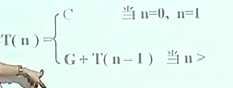
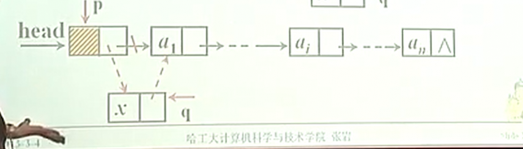
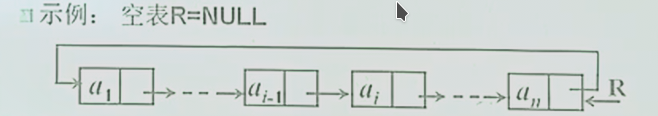
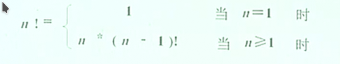
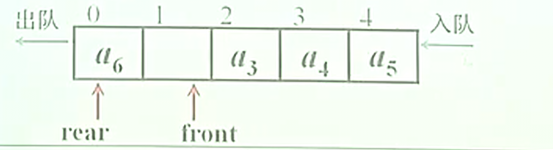
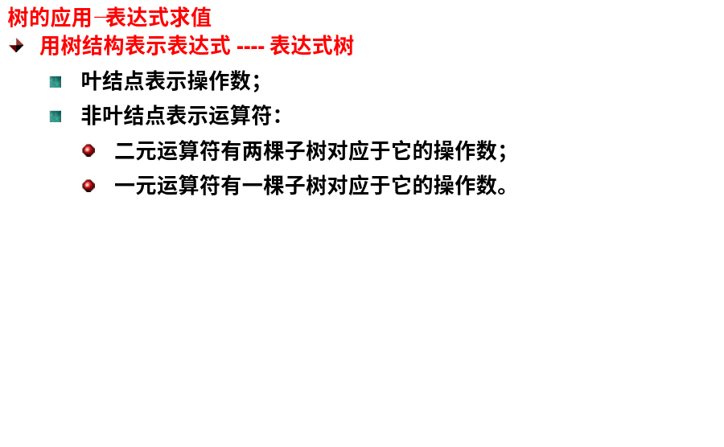
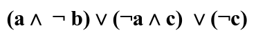

# 数据结构与算法的概念

## 数据结构的基本概念

* 数据: 一切能输入到计算机中并能被计算机程序识别和处理的符号集合
  
  * 数值数据: 整数, 实数等
  
  * 非数值数据: 图形, 图像, 声音, 文字等

* 数据元素: 数据的基本单位, 在计算机程序中通常作为一个整体进行考虑和处理

* 数据项: 构成数据元素的不可分割的最小单位

* 数据对象: 具有相同性质的数据元素的集合

* 结点: 数据元素在计算机内的位串表示

* 域(字段): 数据元素中数据项在计算机内的表示

* 数据结构: 数据元素之间的相互关系, 这种关系是抽象的, 及并不涉及书库元素的具体内容, 是数据元素及其相互间的关系的数学描述

* 相互之间存在一定关系的数据元素的集合

* 按照试点的不同, 数据结构分文逻辑结构和存储结构

## 两种基本的存储结构

* 顺序存储结构: 用一组连续的存储单元一此处数据元素, 数据元素之间逻辑关系有元素的存储位置来表示(逻辑相邻, 存储也相邻)

* 链接存储结构: 用一组任意的存储单元存储数据元素, 数据元素之间的逻辑关系用指针来表示(逻辑相邻, 存储不一定相邻)

## 抽象数据类型(Abstract Data Type)

* 定义: 一个数学模型和该模型上定义的操作集合的总称

* ADT是程序设计语言中输一局类型给年的进一步推广和金鱼ibu抽象

* 例4: ``ADT int=({x|xEZ},{+,-,*,/,%,==})*)``

* 统一数学模型上定义不同的操作集, 则他们代表不同的ADT

* 实现: 用适当的数据结构来表示ADT中的数学模型, 并用一组函数(方法) 来实现该模型上的各种操作

* 数据类型是一组值的集合

* 数据结构是数据元素之间的抽象关系

* 抽象数据型是一个数据模型及在模型上定义的操作集的总称

* 数据形式根据数据结构分类的, 同眉形的数据元素的数据结构相同

* 数据结构则是抽象数据性中数学模型的表示

* ADT是数据类型的进一步推广和进一步的抽象

## 算法及算法分析

* 算法(algorithm)是对特定问题求解步骤的一种描述, 是指令的有限序列

* 算法的五大特性: 
  
  * 输入: 一个算法有零个或多个输入
  
  * 输出: 一个算法有一个或多的输出
  
  * 有穷性: 一个算法必须总是在执行有穷不之后结束, 且每一步都在有穷时间内完成
  
  * 确定性: 算法中的每一条指令必须有确切的含义, 对于相同的输入只能得到相同的输出
  
  * 可行性: 算法描述的操作可以通过已经实现的基本操做执行有限次实现

* 算法分析: 时间复杂性, 空间复杂性

### 算法分析----时间复杂度分析

* 算法的执行时间=每条语句执行时间之和
  
  * 每条语句执行时间: 执行次数x执行一次的时间(单位时间)
    
    * 执行一次的时间: 指令系统, 编译的代码质量

* 算法的执行时间->每条语句执行次数之和->基本语句的执行次数

* 例: 

```c
for(i=1;i<=n;i++)
for(j=1;j<=n;j++)
x++;
```

* 算法的执行时间, 是基本(操作)语句重复执行的次数, 他是问题规模的一个函数, 我们把这个函数的渐近阶成为该算法的时间复杂度
  
  * 问题规模: 输入量的多少
  
  * 基本语句: 是执行次数与整个算法的执行次数成正比的操作指令

* 例: 问题规模: n, 基本语句: x++, 时间复杂性: O(n^2)

### 算法分析: 大O符号

* 定义: 若存在两个正的常数c和n0, 对于任意n>=n0, 都有T(n)<=c x f(n), 则称T(n)=O(f(n))
  
  

* 在计算算法时间复杂度时, 可以忽略所有低次幂(低阶)项和最高次幂(最高阶)项的系数

* 例:4r c

```c
for(i=1;j<=n;++i)
for(j=1;j<=n;++j)
{
    c[i][j]=0;
for(k=1;k<=n;++k)
c[i][j]+=a[i][k]*b[k][j];
}
```

问题规模: n, 基本语句: * 复杂度: O(n^3)

### 算法分析: 最好情况,  最坏情况, 平均情况

* 例: 在一微整形数组A[n]中顺序查找与给定值k相等的元素(假设该数组中有且仅有一个元素值为k)

```c
int Find(int A[], int n)
{
    for (i=0;i<n;i++)
if(A[i]==k)break;
return i;
}
```

* 课本10页1.4.3

### 算法分析: 常见的时间复杂度

* 常见阶的比较: O(1)<O(log2n)<O(n)<O(nlog2n)<O(n^2)< O(n^3)<... <  O(2^n) < O(n!)

### 算法分析: 时间复杂性分析的根本方法

### 时间复杂性的运算法则

* 设T1(n)=O(f(n)), T2(n)=O(g(n)), 则
  
  * 加法规则: T1(n)+T2(n)=O(max{f(n),g(n)})
  
  * 乘法规则: T1(n)*T2(n)=O(f(n)* *g(n))

* 时间复杂性的分析方法:
  
  * 首先求出程序中个语句, 各模块的运行时间
  
  * 在求出整个程序的运行时间

### 算法分析: 各种语句和模块分析应遵循的规则

* 赋值语句或读/写语句: 运行时间通常取O(1), 有函数调用的除外, 此时要考虑函数的执行时间

* 语句序列: 运行时间由加法规则确定, 即该序列中耗时最多的语句的运行时间

* 分支语句: 运行时间由条件测试(通常为O(1))加上分支中运行时间最长的语句的运行时间

* 循环语句: 循环时间是对输入数据重复执行n此循环体所好时间的总和
  
  * 每次重复所好时间包括两部分, 已是循环题本身的运行时间, 二十计算循环参数, 测试循环终止条件和跳回循环头所好时间, 后一部分通常为为O(1)

* 函数调用语句: 
  
  * 若程序中只有非递归调用用, 则从贝雕函数一开始分析, 这种被调用函数本身没有其他函数调用, 计算这种函数的运行时间, 然后考虑有函数调用的任意一个函数P(), 在P()调用的全部函数运行时间都计算完后, 即可开始就算P()的运行时间
  
  * 若程序中有递归调用, 责令每个递归函数对应一个位置时间开销函数T(n), 其中n是该函数参数的大小, 之后列出关于T的递归方程并求解

* 求n!的递归算法

```c
long fact(int n)
{
    if(n==0)||(n==1)
return(1);
elst
return(n*fact(n-1));

}
```

时间复杂性的递归方程:




# 线性表

## 线性表及顺序存储

### 线性表的逻辑结构

* 线性表: 是由n(n>=0)个性质(类型)相同的元素组成的序列

* 记为: L=(a1,a2,a3,......,ai-1,ai,ai+1,....,an)

* ai(1<=i<=n)称为数据元素

* n为线性表中元素个数, 称为线性表的长度, 当n=0时, 为空表, 极为L=( )

* 图示表示:
  
  * 线性表L=(a1,....ai,....an)的图形表示如下:
    
    a1----- a2 -----a3 ------ a4 - -  -  -  -  - an

* 逻辑特征: : L=(a1,a2,a3,......,ai-1,ai,ai+1,....,an)
  
  * 有限性: 线性表中数据元素的个数是有穷的
  
  * 相同性: ai为线性表中的元素元素类型相同
  
  * 相继性: 
    
    * a1为表中第一个元素, 无前驱元素, an为表中最后一个元素, 无后继元素
    
    * 对于...ai-1, ai, ai+1...(1<i<n), 称aj-1为ai的直接前驱, ai+1为ai的直接后继
    
    * 中间不能有缺项

### 定义线性表的操作(算法):

* 设L是类型为LIST线性表实例, x的型为ElemType的元素实例, p为位置变量, 所有操作描述为:
  
  * insert(x,p,L)
  
  * Locate(x,L)
  
  * Retrieve(p,L)
  
  * Delete(p,L)
  
  * Previous(p,L)
  
  * Next(p,L)
  
  * MakeNull(L)
  
  * First(L)
  
  * END(L)

* ADT应用举例:
  
  * 设计函数DeleteVal(LIST &L, ElemType d), 其功能为删除L中所有值为d的元素.

```c
void DeleteVal(LIST &L, ElemType d)
{
    position p;
p=First(L);
while(p!=end(L))
{if(Same(Retrieve(p,L),d))
Delete(p,L);
else
p=Next(p,L);
}
}
```

### 线性表的存储结构----顺序表

* 顺序表:  拔下进行表的元素按照逻辑顺序依次存放在数组的连续单元内, 在用一个整形两表示最后一个元素所在的单元的下标, 即表长

* 存储结构特点:
  
  * 元素之间逻辑上的相继关系吗用物理上的相邻关系来表示, (用物理上的连续性刻画逻辑上的相继型)
  
  * 是一种随机访问存取结构, 也就是可以随机存取表中的任意元素, 其存储位置可有一个简单直观的公式来表示

* 存储结构定义: 
  
  * 类型定义: 
    
    ```c
    #define max 100
    struct LIST{
        ElemType elements[max];
    int last;
    }
    ```

* 位置类型: 

```c
typedef int position;
```

* 线性表的实例L: ``LIST L;``

* 元素和长度:
  
  ``L.elements[p]`` L的第p个元素
  
  ``L.last`` L的长度, 最后元素的位置

#### 操作的实现----插入操作

* 操作接口
  
  ```c
  void Insert (ElemType x, position p, LIST &L)
  ```

* 插入前: ``(a1,...ap-1,ap,...,an)``

* 插入后: ``(a1,...ap-1,x,ap,...,an)``

ap-1和ap之间的逻辑关系发生了变化->顺序存储要求存储位置反应逻辑关系->存储位置要反映这个变化

* 什么时候不能插入
  
  * 表满时: last>=Max
  
  * 合理的插入位置: 1<=i<=last+1
  
  * 注意边界条件

```c
void Insert(ElemType x, positon p, LIST &L)
{
    position q;
if(L.last>=Max-1)
cout<<"表满";
else if ((p>L.last+1)||(p<1))
cout<<"指定位置不存在";
else{
    for(q=L.last;q>=p;q--)
L.elements[q+1]=L.elements[q];
L.elements[p]=x;
L.last=L.last+1;
}
}
```

* 时间性能分析
  
  * 基本语句?
  
  * 最好情况(i=n+1):
    
    * 基本语句执行0次, 时间复杂度为O(1)

* 最坏情况(i=1): 基本语句执行n次, 时间复杂度为O(n)

* 平均情况(i<=i<=n+1):


* 时间复杂度为O(n)

#### 操作的实现----删除操作

* 操作接口: void Delete(position p, LIST &L)

* 删除前: (a1, ..., ap-1, ap, ap+1, ..., an)

* 删除后: (a1, ..., ap-1, ap+1, ..., an)

```c
void Delete(position p, LIST &L)
{
    position q;
if ((p>L.last)||(p<1))
cout<< "指定位置不存在";
else{
    L.last=L.last-1;
for(q=p;q<=L.last;q++)
L.elements[q]=L.elements[q+1];
}
}
```

* 时间复杂性: O(n)

* 其他操作的实现

```c
position Locate(Elemtype x; LIST L)
{Position q;
for (q=1;q<=L.last;q++)
if(L.elements[q]==x)
return(q);
return(L.last+1);
} //时间复杂性: O(n)
```

```c
ElemType Retrieve(position p, LIST L)
{
    if (p>L.last)
cout<<"指定位置不存在";
else
return(L.elements[p]);
}// 时间复杂性: O(1)
```

```c
position Previous(position p, LIST L)
{if((p<=1)||(p>L.last))
cout<<"前驱位置不存在";
else
return(p-1);
}//时间复杂性: O(1)
```

```c
position Next(position p, LIST L)
{if((p<1)||(p>=L.last))
cout<<"前驱位置不存在";
else
return(p+1);
}//时间复杂性: O(1)
```

```c
position MakeNull(LIST &L)
{
    L.last=0;
return(L.last+1);
}//时间复杂性: O(1)
```

```c
position First(LIST L)
{
   if(L.last>0) return(1);
elst cout<<"表为空";
}//时间复杂性: O(1)
```

## 线性表的链式存储

### 单链表

* 单链表: 一个线性表由若干个结点组成, 每个结点均含有两个域: 存放元素的信息域和存放其后继结点的指针域, 这样就形成一个单向链接式存储结构, 简称单向链表或单链表

* 存储结构特点:
  
  * 逻辑次序核物理次序不一定相同
  
  * 元素之间的逻辑关系用指针表示
  
  * 需要额外空间存储元素之间的关系

#### 存储结构定义

* 结点结构: data(数据域) next (指针域)

* 存储结构类型定义:

```c
struct celltype{
    ElemType element;
celltype *next;
}; /*结点型*/
typedef celltype *LIST /*线性表的型*/
typedef celltype *position;/*位置型*/
```

* 单链表图示:
  
  * 带表头结点的单链表


* 不带表头结点的单链表


* 表头结点的作用
  
  * 空表和非空表表示统一
  
  * 在任意位置的插入或者删除的代码统一
  
  * 注意: 是否带表头结点在存储结构定义中无法体现, 由操作决定

#### 操作的实现----插入操作


q = (struct celltype*)malloc(sizeof(struct celltype));;

q -> data=x;

q -> next = p-> next;

p -> next = q;z



```c
void insert (ElemType x, position p, LIST &L)
{position q;
q = (struct celltype*)malloc(sizeof(struct celltype));
q -> data =x;
q -> next = p -> next;q
p -> next =q;
}//时间复杂性: O(1)
```

#### 操作的实现----删除操作

q=p->next

p-next=q->next;

delete q;


```c
void Delete(position p, LIST &L)
{position q;
if(p->next!=NULL){
    q=p->next;
p->next=q->next;
free(q); //delete q;
}//时间复杂性: O(1)
```

```c
position Locate(Elementtype x, LIST L)
{
    position p;
p = L;
while (p->next !=NULL)
if(p->next->data ==x)
return p;
else
p=p->next;
return 0;

}//时间复杂性: O(n)
```


```c
position Previous(position p, LIST L)
{
    position q;
if(p == L->next)
cout <<"不存在前驱位置";
else{
    q=L;
while(q->next != p ) q=q->next;
return q;
}
}//时间复杂性: O(n)
```

```c
position Next(position p, LIST L)
{position q;
if(p->next == NULL)
cout <<"不存在后继位置";
elst{
    q=p->next;
return q;
}
}//时间复杂性: O(1)
```

```c
position MakeNull(List &L)
{
    L=(struct celltype*)malloc(sizeof(struct celltype));;
L->next=NULL;
return L;
}//时间复杂性: O(1)
```

```c
position First(List L)
{
    return L;
}//时间复杂性: O(1)
```

```c
position End(LIST L)
{
   position q;
q=L;
while(q->next!=NULL) q=q->next;
return (q);

}//时间复杂性:O(n)
```

* 例: 设计一个算法, 遍历线性表, 即按照线性表中元素的顺序, 依次访问表中的每一个元素, 每个元素只能被访问一次

```c
struct celltype{
    ElemType data;
celltype *next;
};/*结点型*/
typedef celltype *LIST;
/*线性表的型*/
typedef celltype *position;
/*位置型*/
}
void Travel(LIST L)
{position p;
p=L->next;
while (p !=NULL){
    cout<<p->data;
p=p->next;
}
}
```

#### 顺序表与链表的比较

| 顺序存储        | 比较参数 | 链式存储       |
| ----------- | ---- | ---------- |
| 固定, 不易扩充    | 表的容量 | 灵活, 易扩充    |
| 随机访问存取      | 存取操作 | 顺序访问存取     |
| 插入删除费时间     | 时间   | 访问元素费时间    |
| 估算表长度, 浪费空间 | 空间   | 实际长度, 节省空间 |

## 线性表的存储结构----静态链表

### 静态链表

* 静态链表:链表的数组表示

* 举例:
  
  * 线性表: L=(a,b,c)
  
  * 线性表: M=(d,e)
  
  * 线性表: avail=9 ---空闲表 


* 把线性表的元素存放在数组的单元中(不一定按逻辑顺序连续存放), 每个单元不仅存放元素本身, 而且还要存放其后记元素所在的数组单元的下标(游标).

* 结点形式: data(数据域)next(游标域)

* 存储结构定义:
  
  * 类型定义:

```c
typedef struct{
    ElemType data;
int next;
}spacestr; /*结点类型*/
spacestr SPACE[maxsize];/*存储池*/
typedef int position, Cursor;
Cursor L, M, avail;
```

### 操作的实现--可用空间初始化

```c
void initialize()
{
    int j;
/*依次链接池中结点*/
for(j=0;j<maxsize-1;j++)
SPACE[j].next=j+1;
/*最后一个结点指针域为空*/
SPACE[j].next=-1;
/*标识线性表*/
avail=0;
}
```

### 操作的实现--可用空间的分配操作

```c
Cursor GetNode() //q=new spacestr;
{ Cursor p;
if(SPACE[avail].next==-1)
p=-1;
else{
    p=SPACE[avail].next;
SPACE[avail].next=SPACE[p].next;
}
return p;
}/*从存储池SPACE中删除结点*/
```

### 操作的实现--可用空间的回收操作

```c
void FreeNode(Cursor q) //delete q;
{
    SPACE [q].next=
SPACE[avail].next;
SPACE[avail].next=q;
}/*放回池中*/
```

### 操作的实现--插入操作

```c
void insert(ElemType x,position p,spacestr *SPACE)
{Position q;
q=GetNode();
SPACE[q].data=x;
SPACE[q].next=SPACE[p].next;
SPACE[p].next=q;}
q=(struct celltype*)malloc(sizeof(struct celltype));;
q->data=x;
q->next=p->next;
p->next=q;
```

## 线性表的存储结构---双向链表

* 双链表: 在单链表的个节点中再设置一个指向其前驱结点的指针域

* 示例: 

* 结点结构:

| prior | data | next |
| ----- | ---- | ---- |

* 优点: 实现双向查找(单链表不易做到), 表中的位置i可以用指示含有第i个结点的指针表示

* 缺点: 空间开销大

* 存储结构定义

```c
struct dcelltype{
    ElemType data;
dcelltype *next, *prior;
};/*及诶单类型*/
/*表和位置的类型*/
typedef dcelltype *DLIST;
typedef dcelltype *position;
```

* 建立

* ```c
  position MakeNull(List &L)
  {
      L=new dcelltype;
  L->next=NULL;
  L->prior = NULL;
  return L;
  }//时间复杂性: O(1)
  ```

### 插入操作

* 在带头结点的表中, 在位置p插入元素x

```c
void insert(ElemType x,position p,DLIST &L)
{s=new dcelltype;
s->data=x;
s->prior=p;
s->next=p->next;
p->next->prior=s;
p->next=s;}
```

### 删除操作

* 再不带头结点的表中, 删除位置p的元素

```c
void Delete(position p, DLIST &L)
{if(p->prior!=NULL)
p-prior->next=p->next;
if(p->next!=NUULL)
p->next->prior=p->prior;
}
```

## 单向环形链表

* 在(不带表头结点)的单向链表中, 使末尾结点的指针与指向头结点, 得到一个环形结构, 用指向末尾结点的指针标识这个表



* 在表左端插入结点LInsert(x,R)->Insert(x,First(R),R)

```c
void LInsert(Elementtype x,LIST &R)
{celltype *p;
p=(struct celltype*)malloc(sizeof(struct celltype));;
p->data=x;
if(R==NULL)
{p->next=p;R=p;}
else
{p->next=R->next=p;}
}
```

* 在表右端插入结点RInsert(x,R)->Insert(x,End(R),R)

```c
void RInsert(ElemType x, LIST R)
{ LInsert(x,R);
R=R->next;}
```

* 用循环链表求解约瑟夫问题

n个人围成一个圆圈, 首先, 从弟1个人从1开始, 顺时针报数, 报道第m个人, 令其出列, 然后从下一个人开始, 从1顺时针报数, 报到第m个人, 在令其出列, ..., 如此下去, 指导员权重只剩一个人位置, 此人即为优胜者

```c
void Josepus(List &Js, int n, int m)
{celltype *p=Js, *prc=NULL;
for(int i=0;i,n-1;j++){
    pre=p;p=p->next;}
cout<<"出列的人是"<<p->data<<endl;
pre->next=p->next; delete p;
p=pre->next;}
}
```

## 线性表的存储结构--一元多项式

### 多项式的代数运算

* 多项式: p(x)=3x^14 +2x^8 +1

* 存储表示: 采用单链表表示

* 实例: 


* 存储结构定义:

```c
struct polynode{
    int coef; //系数
int exp; //指数
polynode *link; //指向下一项的指针;
};//结点类型
typedef polynode *polypointer; //多项式的诶型
```

* 算法Attach(c,e,d): 建立一个新结点, 起系数coef=c, 指数exp=e, 并把它连接到d所指结点之后, 返回该结点指针

```c
polypointer Attch(int c, int e, polypointer d)
{polypointer x;
x=new polynode;
x->coef=c;
x->exp=e;
d->link=x;
return x;}
```

* 多项式加法

```c
polypointer PolyAdd(polypointer a, polypointer b)
{
    polypointer p,q,d,c;
int y;
p=a->link; q=b->link;
c=new polynode; d=c;
while ((p!=NULL)&&(q!=NULL))
switch(Compare (p->exp,q->exp))
{case '=':
y=p->coef+q->coef;
if(y) d=Attch(y,p_exp,d);
p=p->link;q=q->link;
break;
case '>':
d=Attch(p->coef,p->exp,d);
p=p->link;
break;
case '<':
d=Attch(q->coef,q->exp,d);
q=q->link;
break;}
while (p != NULL)
{d=Attch(p->coef, p->exp,d);
p=p->link;}
while (q!=NULL)
{d=Attch(q->coef,q->exp,d);
q=q->link;
d->link=NULL;
p=c;c=c->link;
delete p;
return c;}
}
```

* 时间复杂性: O(m+n), 其中m和n分别是两个多项式最高次幂

## 特殊的线性表 --- 栈

* 栈: 限定仅在表尾进行插入和删除操作的线性表

* 空栈: 不含任何数据元素的栈

* 栈顶和栈底: 允许插入(入栈, 进栈, 压栈)和删除(出栈, 弹栈)的一段称为栈顶, 另一端称为栈底

* 栈的示意图:


* 栈的操作:
  
  * Makenull(s) 初始化一个栈
  
  * Top(s) 访问栈顶元素(不弹出来)
  
  * Pop(s) 把栈顶元素弹出来(不在栈里了)
  
  * Push(x, s) 压栈, 把x压到s里  
  
  * Empty(s) 判断是否为空

### 栈的顺序存储结构及实现

  

 进栈: top加1 栈空:top=-1, 出栈 top减1 栈满:top=MAX_SIZE

```c
//栈的顺序存储结构定义
typedef struct{
    ElemType elements[max];
int top;}STACK;
}
```

* STACK S;

* 栈的容量: max-1;

* 栈顶指针: S.top

* 栈顶元素: S.elements[S.top];

* 栈空: S.top-1;

* 栈满: S.top=max-1;


### 栈的数组实现---顺序栈

```c
void MakeNull(STACK &S)
{S.top=-1;}
```

```c
Boolean Empty(STACK S)
{if(S.top<0)
return TRUE
else 
return FALSE;
}
```

```c
ElemType Top(STACK S)
{if(Empty(S)
return NULL;
else
return (S.elements[S.top]);
}
```

```c
void Pop(STACK &S)
{
    if(Empty (S))
cout <<"栈空";
else
S.top=S.top-1;
}
```

```c
void Push(ElemType x, STACK &S)
{
    if(S.top==ma-1)
cout<<"沾满";
else
{S.top=S.top+1;
S.elements[S.top]=x;
}
}
```

### 栈的指针实现 --- 链栈

* 链栈: 栈的链接存储结构


* 栈的链式存储结构定义

```c
struct node{
    ElemType data;
node *next;
};//结点的型
typedef node *STACK;//栈的型
```


* 栈的操作的实现

```c
STACK MakeNull()
{STACK s;
s=new node
/*s=(node *)malloc(sizeof(node));*/
s->next=NULL;
return s;}
```

```c
boolean Empty(STACK stk)
{if (stk->next)
return FALSE;
else
return true;
}
```

```c
void Push(Elementtype elm, STACK stk)
{
    STACK s;
s=new node;
s->data=elm;
s->next=stk->next;
stk->next=s;
}
```

```c
void Pop(STACK stk)
{STACK s;
if(stk->next){/*stk->next!=NULL*/
s=stk->next;
stk->next=s->next;
delete s; /*free(s)*/}
}
```

```c
ElemType Top(STACK stk)
{if(stk->next)
return(stk->next->data);
else
return NULLELE;
}
```

### 栈与递归调用

* 递归调用的定义: 子程序(或函数)直接调用自己或通过一系列调用语句间接调用自己, 是一种描述问题和解决问题的基本方法

* 递归的基本思想: 把一个不能活不好求解的大问题转化为一个或几个小问题, 再把这些小为题进一步分解成更小的小问题, 直至每个小问题都可以直接求解

* 递归的要素
  
  * 递归边界条件: 确定递归iudao何时终止, 也成为递归出口
  
  * 递归模式: 大问题如何分解成小问题的, 也成为递归体

* 递归调用举例: 求阶乘的函数



```c
long fact(int n)
{
    if((n==0) return 1;
else return n*fact(n-1);
}
```

#### 递归过程与递归工作记录

* 每一次递归调用时, 需要为过程中使用的参数, 局部变量和返回地址等另外分配存储空间

* 每层递归调用需分配的空间形成递归工作记录, 按后进先出的栈组织


### 栈的应用

#### 数值转换 ---- 是计算机实现计算的基本问题

* 方法: 除留余数法, 例如对输入的任意非负十进制整数, 打印输出与其等值的八进制数

```c
void main()
{
    STACK s=NEWSTACK();
cin>>n;
while(n){
    Push(n%8,s);
n/=8;
}
while(!Empty(s)){
    cout<<Top(s);
POP(s);
}
}
```

* 迷宫求解问题: 一个迷宫可用下图所示方阵[m,n]表示, 0表示能通过, 1表示不能通过, 先假设耗子从左上角[1,1]进入迷宫, 设计算法, 寻求一条从右下角[m,n]出去的路径


算法求精

```c
void GETMAZE(maze,mark,move,s)
{(i,j,v)=(1,1,1); mark[1,1]=1;top=0;
do{g=move[v,1]; h=move[v,2];
if((g==m)&&(h==n)&&(maze[m,n]==0)) 
{output(S);return;} //判断是否是出口
if(maze[g,h]==0)&&mark[g,h]==0))
{mark[g,h]=1;Push(i,j,v,s);(i,j,v)=(g,h,1);}
else if(v<8)
v=v+1; //换一种方法
else{while((s.v==8)&&(!Empty(s))) POP(s); //无路可走
if(top>0)
(i,j,v++)=Pop(s);};
}while((top&&(v!=8));
cout<<"路径不存在!";
}
```

#### 表达式求值


* 高级语言中, 采用类似语言的中缀表达式, 但计算机对中缀表达式的处理是很困难的, 而对后缀或前缀表达式则显得非常简单

* 后缀表达式的特点:
  
  * 在后缀表达式中, 变量(操作数)出现的顺序与中缀表达式顺序相同
  * 后缀表达式中不需要括号规定计算顺序, 而由运算操作符的位置来确定运算顺序

* 将中缀表达式换成后缀表达式
  
  * 对中缀表达式从左至右依次扫描, 由于操作数的顺序保持不变, 当遇到操作数时直接输出
  
  * 为调整运算顺序, 设立一个栈用以保存操作符, 扫描到操作符时, 将操作压入栈中
    
    * 进栈的原则是保持栈顶操作符的优先级要高于栈中其他操作符的优先级
    
    * 否则, 将栈顶操作符依次退栈并输出, 直到满足要求为止
  
  * 遇到"("进栈, 当遇到")"时, 退栈输出直到")"为止

* 由后缀表达式计算表达式的值
  
  * 对后缀表达式从左至右依次扫描, 遇到操作数时, 将操作数进栈保存
  
  * 当遇到操作符时, 从栈中退出两个操作数并作相应运算, 将计算结果进栈保存, 直到表达式结束, 栈中唯一元素即为表达式的值

## 队列的存储及基本操作

* 队列: 只允许在一段进行操作, 而另一端进行删除操作的线性表

* 空队列: 不含任何数据元素的队列

* 队尾和队首: 允许插入(也称入队, 进队)的预断称为队尾, 允许删除(也称出队)的一段成为队首

* 队列的操作特性: 先进先出

* 队列的操作: 
  
  * `MakeNull(Q)`
  
  * `Front(Q)`
  
  * `EnQueue(x,Q)`
  
  * `DeQueue(Q)`
  
  * Empty(Q)


* 队首指针即为链表的头结点指针

* 增加一个指向队尾结点的指针

* 非空队列:


* 空队列


### 队列的链接存储结构及实现

* 存储结构定义: 

```c
//结点的类型
struct celltype{
    ElemType data;
celltype *next;
};
//队列的类型:
struct QUEUE{
    celltype *front;
celltype *rear;
};
```

### 操作的实现---初始化和判空

```c
void MakeNull(QUEUE &Q)
{
    Q.front=(struct celltype*)malloc(sizeof(struct celltype));;
    Q.front->next=NULL;
Q.rear=Q.front;
}
```


```c
boolean empty(queue &q)
{if(q.front==q.rear)
return true;
else
return false;}
```

### 操作的实现---入队


```c
void EnQueue(ElemType x, QUEUE &Q)
{
    q=(struct celltype*)malloc(sizeof(struct celltype));;
q->data=x;
q->next=NULL;
Q.rear->next=q;
Q.rear=q;
}
```

### 操作的实现---出队


```c
void DeQueue(QUEUE &Q)
{
    if(Q.rear==Q.front)cout<<"队空";
p=Q.front->next;
Q.front->next=p->next;
if(p->next==NULL) Q.rear=Q.front;
delete p;1
}
```

### 操作的实现---返回队首元素

```c
ElemType Front(QUEUE Q)
{
    if(Q.front->next)
return Q.front->next->data;
} 
```

## 队列的数组存储结构及实现

* 如何改进出队的时间性能
  
  * 所有元素不必存储在数组的前n个单元
  
  * 只要求队列的元素存储在数组中连续单元
  
  * 设置队头, 队尾两个指针  

* 当元素被插入到数组中下标最大的位置上之后,  队列的空间就用尽了, 但此时数组的地段还有空闲时间,  这种现象叫做假溢出

* 循环数组: 将数组最后一个单元看成是0号单元, 即把数组头尾相接---按模加一

* 区分队空, 队满的判定条件
  
  * 方法一: 增设一个存储队列中元素个数的计数器count, 当front==rear且count==0时, 队空, 当front==rear且count==MaxSize时, 队满, 
  
  * 方法二: 设置标志flag, 当front==rear且flag==0时为队空 ; dangfront==rear且flag==1时为队满
  
  * 方法三: 保留队空的判定条件: front==rear, 把队满判定条件修改为`((rear+1)%MaxSize==front)`
    
    * 代价: 浪费一个元素空间, 队满时数组中有一个空闲单元

* 存储结构的定义:

```c
struct queue{
    elemtype data[maxsize];
int front;
int rear;
};
```

 

### 操作的实现---队列初始化

```c
void MakeNull(QUEUE &Q)
{
    Q.front=MaxSize-1;
Q.rear=MaxSize-1;

}
```


### 操作的实现---队列判空

```c
bool Empty(QUEUE Q)
{if(q.rear==Q.front)
return TRUE;
else 
return FALSE;}
```

### 操作的实现---返回队首元素

```c
elemtype front(queue q)
{if(empty(q)) return nullese;
else{
    return(q.data[(q.front+q)%maxsize]);
}
```

### 操作的实现---入队

```c
void EnQueue(ElemType x, queue &Q)
{if ((Q.rear+1)%MaxSize==Q.front)
cour<<"队列满";
else{Q.rear=(Q.rear+1)%MaxSize;
Q.data[Q.rear]=x;
}
```

### 操作的实现---出队

```c
void Deeuque(Queue q);
{if(Empty(Q))
cout<<"空队列"<<endl;
else
Q.front=(Q.front+1)%MaxSize;
}
```

## 特殊线性表---串

### 串的逻辑结构

* 串: 0个或多个字符组成的有限序列

* 串长度: 串中所包含的字符个数

* 空船" 长度为0的串, 记为:" "

* 非空串通常记为: "s='s1 s2 ......sn"
  
  * 其中, S是船名, 双引号是定界符, 双引号引起来的部分是串值, si(1<=i<=n)是一个任意字符
  
  * 字符集: ASCII吗, 扩展ASII吗, Unicode字符集

子串: 串中人一个连续的字符组成的子序列

主串: 包含子串的串

子串的位置: 字串的第一个字符在著串中的序号 

* 串的操作:
  
  `string MakeNull();`
  
  `bool IsNull(S)`
  
  `void In(S,a)` //插入
  
  ` int len(S);`长度
  
  `void Concat(S1,S2);` 把2个串拼成一个串
  
  `string Substr(S,m,n);` 在S中取出m~n字串
  
  `bool Index(S,S1);` 在主串中找S1

* 顺序串: 用数组来存储串中的字符序列

| 非压缩形式 | h    | i   | n   | e   | s   | e   |
| ----- | ---- | --- | --- | --- | --- | --- |
| 压缩形式  | chin | ese |     |     |     |     |

* 链接串: 用链接存储结构来存储串


* 模式匹配: 给定主串S="s1,s2,,...,sn",和模式T="t1,t2...tm"在S中寻找T的过程成为模式匹配, 如果匹配成功, 返回T在S中的位置, 如果匹配失败, 返回0

(课本60页) 

## 多维数组

### 数组的基本操作

* 初始化: `Create()` u建立一个空数组 `int A[][]`

* 存取: `Retrieve(array, index)` 给定一组下标, 独处对应的数组元素 `A[i][j]``

* 修改: `Store(array, inde, value)` 给定一组下标, 存储或修改其相对应的数组元素

* 无需插入和删除操作

### 数组的存储结构

* 数组没有插入和删除操作, 所以不用预留空间, 适合采用顺序存储

#### 顺序存储

* 用一组连续的存储单元原来实现多维数组的存储

* 高位数组可以看成是有多个地位数组组成的

#### 二维数组的存储与寻址

* 按行优先: 先行后列, 先存储行好较小的元素, 行好相同先存储列好较小的

* 按列优先....

(课本67页)

#### 特殊矩阵的压缩存储

* 特殊矩阵: 矩阵中很多值相同的元素并且它们的分布有一定的规律

* 稀疏矩阵: 矩阵中有很多特定值的(如0)元素

* 压缩存储的基本思想是: 为多个值相同的元素之分配一个存储空间, 对特定值得元素不分配存储空间

* 对称矩阵的压缩存储
  
  * 对称矩阵特点: aij=aji, 只存储下三角部分元素

#### 稀疏矩阵的压缩存储---三元组顺序表

* 稀疏矩阵中的非零元素的分布没有规律

* 将稀疏矩阵中的每个非零元素表示为:(行好, 列号, 非零元素值) ---三元组表

```c
typedef struct{
    int i,j;
ElemType v;
}Triple;
typedef struct{
    Triple data[MaxSize+1];
int mu,nu,tu;
}TSMatrix;
```

#### 稀疏矩阵的压缩存储---十字链表

采用链接存储结构存储三元组表, 每个非零元素对应的三远足为一个链表结点, 结构为

| row  | col | item  |
| ---- | --- | ----- |
| down | \|  | right |

row: 存储非零元素的行号

col: ......列号

item: ....值

right: 指针域, 值相同一行中的下一个三远足

down: ......列......

## 广义表

* 广义表: n(n>0)个数据元素的有限序列, 记作: `LS=(a1,a2,....,an)`

* ai可以是单个的数据元素, 也可以是一个广义表, 分别成为LS的单元素(或原子)和子表

* 长度: 广义表LS中的直接元素的个数

* 深度: 广义表中括号的最大嵌套层数

* 表头: 广义iao非空时, 称第一个元素为LS的表头

* 表尾: 广义表LS中除表头外其余元素组成的广义表

* 广义表性质:
  
  * 广义表的元素可以是字表, 字表的元素还可以是字表, 广义博鳌是一个多层次的结构(层次性);
  
  * 一个姑娘广义表可以被其他广义表所共享(共享性)
  
  * 广义表可以是其本身得子表(递归性)

### 广义表基本操作:

* `Cal(L)` 返回广义表L的第一个元素

* `Cdr(L)`返回除第一个元素外的所有元素

* `Append(L,M)` 返回广义表L+M

* `Equal(L,M)` 判断是否相等

* Length(L)求长度

### 广义表存储结构

```c
struct listnode{
    listnode *link;
boolean tag;
union{
    char data;
listnode *dlink;
}element;
};
typedef listnode * listpointer;
```

### 广义表操作的实现

```c
bool Equal(listpointer S, listpointer T)
{boolean x,y;
y=FALSE;
if ((S==NULL)&&(T==NULL))
y=TRUE;
else if ((S!=NULL)&&(T!=NULL))
if(S->tag==T-tag)
{if(S->tag==FALSE
{if (S->element.data==T->element.data)
x=TRUE;
else
x=FALSE;
else
x=Equal(S->element.data, T->element.data);
if(x==TRUE)
y=Equal(S->link,T->link);
}
return y;
} //S和T均为非递归的广义表
```

# 树与二叉树

* 非线性结构: 1对多关系, 层次关系

* 一个结点X组成的集合{X}是一棵树, 这个结点X称为这棵树的根(root)

* 假设X是一个结点, T1,...Tk是k棵互不相交的树, 可以构造一棵新树, 令X为根, 并有k条边由X指向树T1,....Tk, 这些边也叫做分支, T1,....Tk, 称作根为X的树之子树(SubTree)

* 递归结论: 递归条件, 递归出口

* 递归定义, 但不会产生循环定义,

* 构造性定义便于树形结构的建立

* 一株树的每个节点都是这株树的某株子树的根

* 直观定义: 除根以外其余结点都有入度 

* 节点的度: 结点所具有的字数的个数

* 树的度: 结点度的最大值

* 叶子节点: 度为0的结点, 也成为终端结点

* 分支结点: 度部位0的结点, 也称作非终端结点

* 结点孩子, 双亲,: 树中某结点子树的根结点成为这个结点的孩子结点点(zijiedian, 儿子) , 这个结点成为他孩子结点的双亲结点(父结点)

* 兄弟: 具有同一个双亲的孩子的结点互称兄弟

* 路(径)和路(径) 长度: 如果树的结点序列n1, nk有如下关系 , 结ni是ni+1的双亲(1<=i<k), 则把n1, nk称为一条由n1至nk的路径, 历经上经过的边的个数成为路径长度

* 祖先, 子孙: 在书中, 如果有一条路径从结点x到结点y, 那么x就成为y的祖先, 而y成为x的子孙

* 结点的层数: 根结点的层数为1, 对其余任何结点, 若某结点在地k曾, 择期孩子结点在地k+1层

* 树的深度: 书中所有结点的最大层数, 也称高度

* 有序树, 无序树, 如果一颗书中结点的各子树从左到右是有次序的, 称这个树为有序树, 反之称为无序树

* 树形结构和线性结构的比较
  
  | 线性结构                  | 树型结构                |
  | --------------------- | ------------------- |
  | 地一个数据元素<br/>无前驱       | 根结点(只有一个)<br/>无双亲   |
  | 最后一个数据元素<br/>无后继      | 叶子结点(可以有多个)<br/>无孩子 |
  | 其他数据元素<br/>一个前驱, 一个后继 | 其他结点<br/>一个双亲, 多个孩子 |

## 二叉树

* 二叉树是一个n(n>=0)各结点的有限集合, 该集合或者为空(成为空二叉树)或者是有一个根结点和两颗互不相交的, 分别称为左子树和右子树的二叉树组成

* 结构特点:
  
  * 每个结点最多只有两颗树子树, 及节点的度不大于2
  
  * 子树有左右之别, 子树的次序(位置)不能颠倒
  
  * 及时某结点只有一颗子树, 也有左右之分

* 二叉树的基本形态: 空二叉树, 只有一个根结点, 根结点只有右子树, 根结点只有左子树, 根结点同时又左右子树

* 左斜树: 所有结点都只有左子树的二叉树

* 右斜树: ...右

* 斜树: 左斜树和右斜树统称为斜树

* 斜树的结构特点: 在写书中, 每一层只有一层结点, 

* 结论: 非线性结构退化后可以称为线性结构

* 线性结构查找算法: O(n)

* 满二叉树: 每个结点都有两个分支

* 完全二叉树:
  
  * 所有的也都出现k或k-1层
  
  * k-1层的所有也都在非终结结点的右边
  
  * 除了k-1层的最右非终结结点可能只有一个(只能是左分支) 或两个分支之外, 其余非终结结点都有两个分支

### 二叉树的性质

* 二叉树的地i层最多有2^i-1个结点(i>=1) (二叉树结构稳定, 最多有两个分支, 可以没有, 可以一个(或左或右)

* 高度为k(k>=1)的二叉树最多有2^h-1
  
  * 高度为k且具有2^k-1个结点的二叉树一定是满二叉树, 高度为k且具有k的结点的二叉树不一定是斜树

* 在非空二叉树中, 如果叶子结点数位n0,度为2, 则有n0=n2+1

* 例: 二叉树共有15个结点, 读书为2的3个, 读书为1有多少个

```c
n=15 n0=4 n2=3 n1=8
```

* 具有n(n>0)个结点的完全二叉树的高度为[log2(n+1)]或[log2n+1] (84页

### 完全二叉树的顺序存储结构的性质

* 若i=1, 则i是根结点 ,无父结点

* i>1, 则i的父节点为[i/2] (向上取整)

* 若2*i<=n, 则i有左儿子且为2*i 否则4儿子且为2i无左儿子

* 若2*i+1<n, 则i有右儿子且为2*i+1, fouzei无右儿子

* 若i为偶数, 且i<n, 则有右兄弟, 且为i+1

* 若i为奇数, 且i<=n&&i!=1, 则其左兄弟, 且为i-1

### 二叉树的遍历操作

* 遍历: 从头到尾访问所有的节点并且每个节点只访问一次

* 按层遍历 根 左子树 右子树

* 遍历的定义: 根据或某种策略按照一定的次序访问二叉树中的每一个结点, 是每个结点被访问一次且只被访问一次

* 遍历的结果是二叉树结点的线性序列, 非线性结构线性化

* 次序: 先序(根)遍历, 中, 后, 层序(次)遍历

* 层序遍历: 从上到下, 从左到右

* 先根: 根左右 中根:左跟右 后跟: 左右根

* 已知先续和中序唯一确定二叉树, 已知后续和中序也可以构造二叉树

* 先序遍历算法

```c
void PreOrder(BTREE BT)
{
    if(!IsEmpty(BT))
{
    visit(Data(BT));
PreOrder(LChild(BT));
PreOrder(Rchild(BT));
}
}
```

```c
//中序遍历算得发
void InOrder(BTREE BT)
{
    if(!IsEmpty(BT))
{
InOrder(LChild(BT));
    visit(Data(BT));
InOrder(Rchild(BT));
}
}
```

```c
//后序遍历算得发
void PostOrder(BTREE BT)
{
    if(!IsEmpty(BT))
{
PostOrder(LChild(BT));
PostOrder(Rchild(BT));
    visit(Data(BT));

}
}
```

## 二叉树的左右链存储结构---动态二叉链表

### 存储结构定义

```c
struct node {
    struct node *lchild;
struct node *rchild;
datatype data;
};

typedef struct node * BTREE;
```

### 建立

```c
BTREE CreateBT(datatype v, BTREE ltree, BTREE rtree)
{
    BTREE root;
root = new node;
root -> data = v;
root -> lchild=ltree;
root->rchild = rtree;
return root;
}
```

* 俺先续序列建立二叉树的左右链存储结构
  
  * 如右图所示二叉树, 输入:ABDH##I##E##CF##J##G#, 其中#表示空

```c
void CreateBT(BTREE &T)
{cin >> ch;
if(ch='#') T=NULL;
else{
    T->data=ch;
CreateBT(T->lchild);
CreateBT(T->rchild);
}
}
```

* 练习: 把用引用实现的函数改成用指针

* 方法3: 建立二叉树的左右链存储结构的非递归算法

```c
struct node *s[max];  /* 辅助指针数组，存放二叉树结点指针 */
BTREE CreateBT (  )
{  int i , j; datatype ch;
    struct node *bt, *p; /* bt为根，p 用于建立结点 */
    cin >> i>>ch ;
    while ( i != 0&&ch != 0) {
           p =new node;         p → data=ch; 
           p → lchild=NULL;  p → lchild=NULL; 
           s[ i ]=p;
           if  ( i == 1 ) bt = p ;
           else {    j =i /2;   /* 父结点的编号 */
                        if ( i %2==0 )   s[ j ]→lchild=p;  /* i 是 j 的左儿子 */
                        else                 s[ j ]→rchild=p; /* i 是 j 的右儿子 */
          }cin >> i>>ch ;}
} 
```

### 先序遍历非递归算法---栈顶保存当前节点左子树

```c
void PreOrder(BTREE root)
{top -1;
while(root=NULL||top!=-1){
    while(root!=NULL){
    cout<<root->data;
s[++top]=root;
root=root->child;
}
if(top!=1){
    root=s[top--];
root=root->child;
}
}
}
```

### 先序遍历非递归算法---栈顶保存当前节点右子树

```c
void preOrder(Btree T)

{Stack S; MakeNull(S); //递归工作栈

struct node* p=T;

while(p!=NULL){

cout<<p->data<<endl;

if(p->rchild!=NULL)

Push(S,p->rchild);

if(p->lchild!=NULL)

p=p->lchild; //进左子树

else{p=Top(S);Pop(S);}//左子树空, 访问右子树

}}
```

### 中序遍历非递归算法

```c
void InOrder(BTREE root)
{top= -1;
while(root!=NULL||top !=-1){
    while(root!=NULL){
    s[++top]=root;
root=root->child;
}
if(top!=-1){
    rppt=s[tpo--];
cout<<root->data;
root=root-rchild;
}
}
}
```

### 后续遍历非递归算法

```c
void PostOrder(BTREE root)
{top = -1; //采用顺序栈, 并假定栈不会发生上溢
while(root !=NULL||top!=-1){
    while(root!=NULL){
    top++;
s[top]ptr=root;
s[top]flag=1;
root=root->lchild;}
wihle(top !=-1l,&& s[top].flag==2){
    root=a[top--]ptr,
cout<<root->data;
}
if(top !=-1){
    s[top].flag=2;root=s[tpo].ptr->child}

}
}
```

```c
void PostOrder(Btree t) //不设标志, 设bianliang
{
    Btree p,pr;Stack s;
MakeNull(s);
p=t;
while(p!=NULL||Empty(s))
{
    while(p!=NULL)
{Push(p,s);
pr=p->rc;p=p->lc;
if(p==NULL)p=pr;}
p=Pop(s);visit(p->data);
if(!Empty(s)&&Top(s)->lc==p)
p=Top(s)->rc;
else p=NULL;
}
} 
```

* 练习题: 在二叉树中增加两个与parent父结点, 写出不用栈进行后序遍历的非递归算大, flag用于区分在遍历过程中达到该点时的走向(每个节点的flag均为0)

```c
struct node{
    char data;
node *lc, *rc, *parent;
int flag;
};
}
```

## 二叉树的层序遍历

* 上节练习题答案:

```c
struct node{ char data; node *lc, *rc, *parent;
int flag;
};
void PostOrder(nide *t) //后续遍历二叉树
{ node *p;
p=t; //t指向二叉树的根, 建立时, 所有结点标志为0
while (p != Null)
switch(p-->flag)
{case -; p->flag=1;
if (p->lc!=Null)p=p->lc;
break;
case 1: p->flag=2;
if(p->rc!=Null)p=p->re;
break;
case 2: p->flag=0;
cout <<p->data;
p=p->parent;
break;
}
}
```

* 层序遍历算法实现步骤:
  
  1. 队列Q初始化
  
  2. 如果二叉树非空, 将根指针入队
  
  3. 循环直到队列Q为空
     
     3.1 q=队列Q的对头元素出对
     
     3.2 访问结点q的数据域
     
     3.3 若结点q存在左孩子, 则将左孩子指针入队
     
     3.4 若结点q存在右孩子, 则将右孩子指针入队 

```c
void LeverOrder (BTREE root)
{front=rear=0; //采用顺序队列, 并假定不会上溢
if(root==NULL)return;
Q[++rear]=root
while(front != rear){
    q=Q[++front];
cout<<q->data;
if(q->lchild!=NULL) Q[++rear]=q->lchild;
if(q->rchild!=NULL) Q[++rear]=q->rchild;
}
}
```

```c
void LeverOrder(BTREE BT)
{
    QUEUE Q; BTREE T;
MAKENULL(Q);
T=BT;
if(!IsEmpty(T)
ENQueue(t,Q);
while(!Empty(Q)){
    T=Front(Q);
visit(data (T));
DeQueue(T);
if(!Lchild(T))
EnQueue(Lchile(T),Q);
if(!Rchild(T))
EnQueue(Rchild(T),Q);
}
}
```

* 计算二叉树结点个数的递归算法

```c
int Count(BTREE T)
{if (T ==NULL) reuturn 0;
else return 1 + Count (T->lchild) + count (T->rchild);}
```

```c
struct node {

    struct node *lchild;

struct node *rchild;

datatype data;

};

typedef node * BTREE;
```

```c
//中序遍历的计数算法
void COunt(BiNode *root)
{
    //n维权巨量并以初始化为0
if(root){
    Coutn(root->lchild);
n++;
Count(root->rchild);
}
}
```

* 求二叉树高的递归算法

```c
int Height(BTREE T)
{if (T == NULL) return 0;
else {int m = Height(T->child);
int n=Height( T->rchild));
return (m>n)?(m+1):(n+1);}}
```

```c
//删除二叉树的递归算法
void Destroy (BTREE T)
{
    if(T!=NULL){
    Destroy (T->lchild);
Destroy(T->rchild);
delete T;
}
}
```

* 交换二叉树所有结点子树的算法

```c
void Exchange (BTREE T)
{Node *p=T,tmp;
if(p!=NULL){
    temp=p->lchild;
p->lchild=p->rchild;
p->rchild=tmp;
Exchange(p->lchild);
Exchange(p->rchild);
}
}
```

```c
void Exchange(BREE T)
{
    struct node *p, *tmp;
top -1; //采用顺序栈并假定不会发生上溢
if()
}
```

```c
void Exchange ( BREE T ) 
{     struct node *p, *tmp; 
       top = -1;      //采用顺序栈，并假定不会发生上溢
       if ( T != NULL ) {
           s[++top] = T；
           while ( top！=-1 ) {
                 p = s[top--]; //栈中退出一个结点
                 tmp = p->lchild//交换子女
                 p->lchild = p->rchild;
                 p->rchild = tmp;
                 if ( p->lchild != NULL )
                       s[++top] = p->lchild;
                 if ( p->rchild != NULL )
                       s[++top] = p->rchild;
           }//使用栈消去递归算法中的两个递归语句
      }
}
```

* 按先序次序打印二叉树中的叶子结点的算法

```c
void PreOrder(BTREE T )
{
    if (T) {
        if (!T->lchild && !T->rchild)
               cout<<T->data;
        PreOrder(T->lchild);
        PreOrder(T->rchild);
   }
}
```

* 二叉树左右链n个结点, 有用链个数: n-1, 空链个数: n+1

## 二叉树的线索链表存储结构---线索二叉树

* 二叉树的线索链表存储结构----线索二叉树

* 若结点p有左孩子，则p->lchild指向其左孩子结点，否则令其指向其（先序、中序、后序、层序）前驱；

* 若结点p有右孩子，则p->rchild指向其右孩子结点，否则令其指向其（先序、中序、后序、层序）后继；

* 如何区分指针是指向其左/右孩子的指针还是指向某种遍历的前驱/后继？
  
  * 在每个结点中增加两个标志位，以区分该结点的的两个链域是指向其左/右孩子还是指向某种遍历的前驱/后继。

* 线索二叉树: 把多余定义出来的空链用上


二叉树


中序线索二叉树

* p->ltag=
  
  * TRUE       p->lchild 指向左孩子
  
  * FALSE     p->lchild 指向（中序）前驱

* p->rtag=
  
  * TRUE p->rchild 指向右孩子
  
  * FALSE p->lchild 指向（中序）后继

* 线索：将结点的空指针域指向其前驱/后继的指针被称为线索；

* 线索化：结点的空链域存放其前驱/后继的过程称为线索化; 

* 线索二叉树：线索化的二叉树称为线索二叉树。

* 二叉树的遍历方式有4种，故有4种意义下的前驱和后继，相应的有4种线索二叉树：
  ⑴ 先序线索二叉树；⑵ 中序线索二叉树；
  
       ⑶ 后序线索二叉树；⑷ 层序线索二叉树。

```c
struct node{
    node *lchild;
node *rchild;
boolean ltag;
boolean rtag;
infotype info
};
```

```c
//非空二叉树：
head->lchild = T； （根）
head->ltag = TRUE ; 
head->rchild = head ;
head->rtag = TRUE ;
```

```c
//空二叉树：
head->lchild = head ;
head->ltag = FALSE ;
head->rchild = head ;
head->rtag = TRUE ;
```

### 线索二叉树的若干算法

* 算法1：在中序线索二叉树中求一个结点p的中序后继p$
  分析:
  (1)当p->rtag==FALSE时，p->rchild 即为所求(线索)。
  (2)当p->rtag==TRUE时，p$为p 的右子树的最左结点。
  算法实现： 
  
  ```c
  node InNext( node p)
  { node Q ;
   Q=p->rchild ;
   if (p->rtag = = TRUE )
   while( Q->ltag = = TRUE )
   Q = Q->lchild ;
   return ( Q ) ;
  }
  ```

* 利用InNext算法, 中序遍历线索二叉树

```c
void ThInOrder(node *Head)
{
    node * temp;
temp=HEAD;
do{
    temp=InNext(temp);
if(temp!=HEAD) visit(temp->info);
}while(temp!=HEAD)
}
```

* 求中序线索二叉树中结点p的先续顺序后继结点p*

```c
node PreNext(node p)
{
    node Q;
if(p->ltag==TRUE)
Q=p->lchild;
else{Q=P;
while(Q->rtag==FALSE)
Q=Q->rchild;
Q=Q->rchild;}
return(Q);
}
```

* 中序线索二叉树的插入算法

```c
void RInsert(node *S,node *R)
{
    node *W;
R->rchild=S->rchild;
R->rtag=S->rtag;
R->lchild=S;
R->ltag=FALSE;
S->rtag=TRUE;
if(R->rtag==TRUE){
    W=InNext(R);
W->lchild=R;
}
}
```

* 算法5：二叉树的（中序）线索化算法-------递归算法
  实现步骤：
  1 如果二叉链表root为空，则返回；否则，
  2 对root的左子树建立线索；
  3 对根结点root建立线索；
  
        3.1 若root没有左孩子，则为root加上前驱线索;
        3.2 若root没有右孩子，则将root右标志置为FALSE；
        3.3 若结点pre右标志为FALSE，则为pre加上后继线索；
        3.4 令pre指向刚刚访问的结点root；
  
  4 对root的右子树建立线索。

```c
BTREE *pre=NULL;  //全局量
void  InOrderTh(BTREE *p) //将二叉树 p中序线索化
{   if( p ){ //p 非空时，当前访问的结点是 p
        InOrderTh( p->lchild ); //左子树线索化
        p->ltag=( p->lchild ) ? TRUE : FALSE; //左(右)孩子非空
        p->rtag=( p->rchild )? TRUE : FALSE; //时,标志1,否: 0
        if ( pre ) { //若*p 的前驱*pre 存在
             if ( pre->rtag ==FASLE) //  *p的前驱右标志为线索
                   pre->rchild=p; // 令 *pre 的右线索指向中序后继
             if ( p->ltag ==FASLE) //   *p的左标志为线索
                   p->lchild=pre;         //令 *p的左线索指向中序前驱
       }
       pre = p;   // 令pre 是下一个访问的中序前驱
       InOrderTh( p->rchild ); //右子树线索化
   }
}
```

* 二叉树的存储:
  
  * 顺序: 完全二叉树, 仿完全树

* 二叉链(链式): 三叉链, 游标, 线索二叉树(作用:利用空间, 遍历二叉树, 求前驱,后继)

* 线索二叉树中由P先求根遍历序列的后继结点(用记号P*来表示)的算法

```c
node *PreNext(node *P)
{node *Q;
if(P->ltag==TRUE)
Q=P->lchild;
else{
    Q=P;
while(Q->rtag==FALSE)
Q=Q->rchild;
Q=Q->rchild;
}
return Q;
}
```

## 树

### 树的基本操作

* Parent( n , T )  求结点 n  的双亲

* LeftMostChild( n  ,  T )  返回结点 n 的最左儿子

* RightSibling( n , T )  返回结点 n 的右兄弟

* Data( n , T )   返回结点 n  的信息

* CreateK k (v , T1 , T2 , …… , Tk ) , k = 1 , 2 , ……

* 建立data域值为v的根结点r , 有k株子树T1 , T2 , …… , Tk ，且自左至右排列；返回r。

* Root( T )   返回树T的根结点

* 树的遍历操作: 从根结点出发，按照某种次序访问树中所有结点，使得每个结点被访问一次且仅被访问一次。

* 树的遍历操作: 树通常有先序（根）遍历、后序（根）遍历和层序（次）遍历三种方式。

* 先序遍历:

⑴ 访问根结点；
⑵ 按照从左到右的顺序先序遍历根结点的每一棵子树

* 后序遍历
  
      ⑴ 按照从左到右的顺序后序遍历根结点的每一棵子树；⑵ 访问根结点。

* 用树的基本操作写先序遍历的递归算法

```c
void PreOrder(node n, TREE T )
{ node c ;
 visit( Data( T ) ) ;
 c = LeftMostChild( n , T ) ;
 while ( c != NULL ) { 
　　 PreOrder( c , T ) ;
 c = RightSibling( c , T ) ;
　}
}
```

* 先序遍历树Ｔ：PreOrder（Root( T ) ， T）

### 树的存储结构

#### 双亲表示法（单链表示、父链表示）

* 每个结点（根结点除外）都只有唯一的双亲结点

* 因此，可以把各个结点（一般按层序）存储一维数组中，同时记录其唯一双亲结点在数组中的下标。


结点结构定义

```c
struct node {
　 char data; //数据域
　　int parent; //指针域，双亲在数组中的下标
} ;　//树的双亲表示法实质上是一个静态链表
typedef node TREE[11];
TREE T;
```

* 求父结点: O(1), 求子结点:O(n), 求兄弟结点: O(n)

* 当改变编号方法: O(n)

#### 孩子链表表示法（邻接表表示）

* 每个结点的孩子看成是一个线性表，且以单链表存储，则n个结点共有 n 个孩子链表。

* 再把 每个单链表的表首结点指针，组织成一个线性表，为了便于进行查找采用顺序存储。

* 最后，将存放 n 个表首结点指针的数组和存放n个结点的数组结合起来，构成孩子链表的表头数组。 

* 存储结构定义

```c
struct  CTNode  {
     int    child ;
     CTNode  *next ;
 };
struct CTBox{
      DataType    data ; 
      CTNode  * firstchild ;
} ;
struct  {
      CTBox  nodes[MaxSize] ; 
　  int   n , r ; 
} CTree ;
```

孩子结点: 

| child | next |
| ----- | ---- |
|       |      |

表头结点:

| data | firstchild |
| ---- | ---------- |
|      |            |

* 复杂数据结构的定义:
  
  * 按曾定义, 从最底层开始
  
  * 最底层由已知的数据类型细分, 如此反复

* 下面用抽象数据性LIST来构造所需的数据结构---邻接表, 首先, 给出其类型的说明如下

```c
typedef int node;
struct celltype{
    node element;
celltype *next;
};
typedef celltype *position;
struct TREE{
    LIST header[maxnodes];
datatype data[maxnodes];
node root;
}; //其中root用于存放树根, 用0表示结点
```

* 用树的这种表示法实现LefeMostChild

```c
node LeftMostChild(node n, TREE T)
{
    LIST L;
L=T.header[n];
if(Empty(L))/*n是叶结点*/
return 0;
else
return(Retrieve(First(L),L));
}
```

#### 二叉链表表示法（（左）孩子－（右）兄弟链表表示）


```c
struct{
    datatype data;
int leftchild;
int rightsibling;
}cellspace[maxnodes];
```

## 森林和二叉树间的转换

### 森林( 树)转换成二叉树

* 连线：
  把每株树的各兄弟结点连起来；
  把各株树的根结点连起来（视为兄弟）

* 抹线：
  对于每个结点，只保留与其最左儿子的连线，抹去该结点与其它结点之间的连线

* 旋转：
  按顺时针旋转45度角（左链竖画，右链横画）

### 二叉树转换成森林

二叉树转换成森林( 树)

* *连线：
  若某个结点 k 是其双亲结点的左孩子，则将该结点 k  的右孩子以及（当且仅当）连续地沿着右孩子的右链不断搜索到的所有右孩子，都分别与结点k 的双亲结点相连；

* 抹线：
  把二叉树中的所有结点与其右孩子的连线以及（ 当且仅当）连续地沿着右孩子的右链不断搜索到的所有右孩子的连线全部抹去;

* 旋转：
  按逆时针旋转45度角（即把结点按层次排列）

### 森林(树)与二叉树之间的对应关系

* 将一株树转换为二叉树，二叉树一定没有右子树(原因？)

* 一般结论：森林中的任何没有右兄弟的结点在对应的二叉树中，该没有右子树；

* 任何一个森林（树）对应唯一的一株二叉树，反之亦然。
  
  * 且第一株树的根对应二叉树的根；
  
  * 第一株树的所有子树森林对应二叉树的左子树；
  
  * 其余子树森林对应二叉树的右子树；

* 森林(树)转换成二叉树的递归算法
  F ={T1,T2, …,Tn}   二叉树B(F)
  若n=0，则B(F)为空；否则，n〉0，则
  B(F)的根就是root（T1）；
  B(F)的左子树是F的第一棵树T1的子树森林；
  B(F)的右子树F的其余子树森林。

* 二叉树转换成森林(树) 的递归算法
  若B 为空，则F 为空；若B 不空，则
  F中的第一株树T1 的根对应二叉树B 的根；
  T1中根结点的子树森林F1是由B的左子树转换来的；
  F中除T1之外其余子树组成的森林F’={T2,…Tn}是由B的右子树转换而来的。

### 森林转化为二叉树的算法

```c
bitree * FORESTTOBITREE(node *p)
{ bitree *s;
  if (p==NULL) s=NULL;
  else
   { s=malloc(sizeof(bitree));
     s->data=T[p->child].data;
     s->lchild=FORESTTOBITREE(T[p->child]->firstchild);
     s->rchild=FORESTTOBITREE(p->next);
   }
  return(s);
}
```

## 树的应用

### 用树结构表示集合

#### ADT集合MFSET

* 集合：性质相同的元素所组成的整体（有限且互不相交）

* 集合上的基本操作
  
  * `Union( Si, Sj, S )`:  If Si∩Sj==Ф， S = Si∪Sj;
  
  * `Find( i, S )`:    求包含i 的集合；
  
  * `Initial( A, x )`:   建立集合A，使之只包含x。
  
  * 例如，S1={1, 7, 8, 9}, S2={2, 5, 10 }, S3={3, 4, 6}，则S1∪S2={1，2，5，7，8，9，10}


```c
#define n 元素的个数
typedef int MFSET[n+1];
/* 集合的“型”为MFSET,元素的“型”为int */
void Union(int i, int j ,MFSET parent)
{    parent[i]=j;/* 归并，结果树之根为j */
}//O(1
```

```c
int Find(int i, MFSET parent)
{   int tmp=i;
    while(parent[tmp]!=0)/* >0,未到根 */
       tmp=parent[tmp]; /* 上溯 */
    return tmp;
}//O(n)
```

#### 改进的ADT MFSET的实现

* 改进“并”操作的原则，即将结点少的并入结点多的；另外，相应的存储结构也要提供支持—以加权规则压缩高度。

```c
typedef struct{
        int father;
        int count; /* 加权 */
} MFSET[ n+1 ];
```

```c
void Union(int A,int B,MFSET C)
{   if(C[A].count > C[B].count) { /* |B|<|A| */
           C[B].father = A; /* 并入A */
           C[A].count += C[B].count;
     }
     else {   /*|A|<|B|*/
         C[A].father = B;  /* 并入B */
         C[B].count += C[A].count;
     }
}
```

```c
int Find(int x, MFSET C)
{      int tmp=x;
       while(C[tmp].father!=0)/*>0,未到根 */
             tmp=C[tmp].father; /* 上溯 */
       return tmp;
}
```

```c
void Initial(int A ,MFSET C)
{      C[x].father=0;
        C[x].count=1;
}
```

#### 集合的等价分类

* 等价关系：集合S上具有自反性、对称性和传递性的二元关系R.

* 等价类：x∈S，y∈S，x≡y  (x，y)∈R或 xRy。

* 集合S上的一个等价关系唯一确定一个等价类的集合S∕R(商集)。

* 等价分类：把一个集合分成若干个等价类的过程(分清、分净)

* 等价分类算法：
  例如集合S = {1,2,3,4,5,6,7}的等价对分别是：1≡2，5≡6，3≡4，1≡4

* 等价分类算法：
  
  1. 令S中的每一个元素自身构成一个等价类，S1,S2,…S7
     2.重复读入等价对（i,  j）
     2.1对每个读入的等价对(i, j),求出i 和j 所在的集合Sk 和Sm（不失一般性）
     2.2若Sk≠Sm,则将Sk并入Sm,并将Sk置空。
     当所有的等价对处理过后，S1,S2,…S7中的非空集合即为S的R等价类

```c
void Equivalence (MFSET S)   /*等价分类算法*/
{     int i ,j , m ,k;
      for(i=1; i<=n+1;i++)
           Initial(i,S);             /*使集合S只包含元素i */
      cin>>i; cin>>j;                   /* 读入第一个等价对*/
      while(!(i==0&&j==0){ /* 等价对未读完*/
            k=Find(i,S);           /*求i的根*/
            m=Find(j,S);          /* 求j的根*/
            if(k!=m)             /*if k==m,i,j已在一个树中，不需合并*/
                 Union(k,m,S);     /*合并*/
           cin<<i; cin<<j;            
      }
}
```

### 判定树

#### 八枚硬币问题

* 假定有八枚硬币a、b、c、d、e、f、g、h，已知其中1枚是伪造的假币，假币的重量与真币不同，或重或轻。要求以天平为工具，用最少的比较次数挑出假币。


#### 判定树的特点

* 一个判定树是一个算法的描述；

* 每个内部结点对应一个部分解；

* 每个叶子对应一个解；

* 每个内部结点连接与一个获得新信息的测试；

* 从每个结点出发的分支标记着不同的测试结果；

* 一个解决过程的执行对应于通过根到叶的一条路

* 一个判定树是所有可能的解的集合

(课本123页)

### 哈夫曼树


#### 哈夫曼树(最优二叉树)

* 在给定权值为w 1 ， w 2… w n的 n 个叶结点所构成的所有扩充二叉树中，WPL = ∑wj · l j最小的称为huffman树。

* 哈夫曼树的特点: 
  
  * 权值越大的叶子结点越靠近根结点，而权值越小的叶子结点越远离根结点。（构造哈夫曼树的核心思想）
  
  * 只有度为0（叶子结点）和度为2（分支结点）的结点，不存在度为1的结点。
  
  * n个叶结点的哈夫曼树的结点总数为2n-1个。
  
  * 哈夫曼树不唯一，但WPL唯一。

#### 哈夫曼树的构造方法

* ⑴ 初始化：由给定的n个权值{w1，w2，…，wn}构造n棵只有一个根结点、左右子树均空的二叉树，从而得到一个二叉树集合F＝{T1，T2，…，Tn}；

* ⑵ 选取与合并：在F中选取根结点的权值最小的两棵二叉树分别作为左、右子树构造一棵新的二叉树，这棵新二叉树的根结点的权值为其左、右子树根结点的权值之和；

* ⑶ 删除与加入：在F中删除作为左、右子树的两棵二叉树，并将新建立的二叉树加入到F中；

* ⑷ 重复⑵、⑶两步，当集合F中只剩下一棵二叉树时，这棵二叉树便是哈夫曼树。


#### 哈夫曼树的存储结构---静态三叉链表

```c
#define n 100 /*叶子树*/
#define m 2*(n)-1 /*结点总数*/
typedef  struct { /* 结点型 */
       double  weight ; /* 权值 */
        int    lchild ;  /* 左孩子链 */
        int    rchild ; /* 右孩子链 */
        int    parent; /* 双亲链 */
}HTNODE ; 
typedef   HTNODE  HuffmanT[m] ;
```


* 哈夫曼树构造算法的实现步骤：
  
  * 1 初始化：将T[0]，…T[2n-2]共 2n-1个结点的三个链域均置空( -1 )，权值为 0 ；
  
  * 2 输入权值：读入 n 个叶子的权值存于T的前 n 个单元T[0]，…T[n], 它们是 n 个独立的根结点上的权值； 
  
  * 3 合并：对二叉树集合进行 n-1次合并：
    
    * 3.1 在二叉树集合T [0]，…T[i-1]中选取权值最小和次最小的两个根结点T[p1]和T[p2]作为合并对象，这里0<= p1，p2<= i –1;
    
    * 3.2将根为T[p1]和T[p2]的两棵二叉树作为左、右子树合并为一棵新二叉树，新二叉树的根结点为T[i]。

* 选取两个最小的权值

```c
void selectMin(HuffmanT T, int n, int &p1, int &p2)
{
    int i,j;
for(i=0;i<n;i++)
if(T[i].parent==-1) {p1=i;break}
for(j=j+1;j<n;j++)
if(T[j].parent==-1) {p2=j;break;}
for(i=0;i<n;i++)
if((T[p1].weight>T[i].weight)&&(T[i].parent==-1)&&(p2!=i)) p1=i;
for(j=0;j<n;j++)
if((T[p2].weight>T[j].weight)&&[T[j].parent==-1)&&(p1!=j)) p2=j;
}
```

* 构造哈夫曼树, T[m-1]为其根结点

```c
void  CreartHT(HuffmanT T)//构造huffam树,T[2n-2]为其根
{  int i ,p1 ,p2;
    InitHT(T);     /*初始化, 将权值及左右子树输入到T[n-1]中 */                                   
    for（i = n; i < m; i++）/*对森林进行合并*/
{              
        SelectMin(T, i-1, &p1, &p2); /*求两个最小熬权值*/     
        T[p1].parent =T[p2].parent = i; /*产生新结点从n开始存放*/
        T[i].lchild= p1； 
        T[i].rchild= p2；
        T[i].weight =T[p1].weight + T[p2].weight；
     }
}
```

#### 哈夫曼编码表的存储结构

* 二叉树存储
  
  * 顺序存储
  
  * 二叉连(左, 右, 子树) 权值, 左, 右, 树
  
  * 三叉链: 左, 右, 父
  
  * 静态三叉链

```c
typedef struct{
   char  ch;   //存储被编码的字符     
   char  bits[n+1]; //字符编码位串
}CodeNode; 
typedef CodeNode HuffmanCode[n];
HuffmanCode    H;
```


* 哈夫曼编码算法的实现

```c
void CharSetHuffmanEncoding( HuffmanT T, HuffmanCode H)
{  //根据Huffman树T 求Huffman编码表 H
   int c, p, i;           // c 和p 分别指示T 中孩子和双亲的位置 
   char cd[n+1];    // 临时存放编码 
   int start;            // 指示编码在cd 中的位置 
   cd[n]=‘\0’;         // 编码结束符 
   for( i =0; i <n;  i++){  // 依次求叶子T[i]的编码
       H[i].ch=getchar();  // 读入叶子T[i]对应的字符
       start=n;                   // 编码起始位置的初值 
       c =i;                         // 从叶子T[i]开始上溯 
       while( (p=T[c].parent)>=0){ // 直到上溯到T[c]是树根位置 
           cd[--start]=(T[p].lchild==c)? ’0’ : ’1’;
           // 若T[c]是T[p]的左孩子，则生成代码0，否则生成代码1
           c=p;      // 继续上溯
       }
       strcpy(H[i].bits,&cd[start]);  //复制编码为串于编码表H
   }
}
```

* 可以用于文件加密, 文件压缩

* 作业1: 在一组表中找出两个最小数算法

* 作业2: lzw压缩算法(散列法) 写出原理报告

* 作业3: 每个字符可以用0,1,2三个数字编码, 建立起扩展的哈夫曼树编码, 译码

* 利用Huffman编码对数据文件编码和译码

* 编码：依次读入文件的字符c ，在huffman编码表H 中找到此字符，若H[i].ch==c，则将c  转换为H[i].bits中的编码串

* 译码：依次读入文件的二进制码 ，在huffman树中从根结点T[m-1]出发，若读入0，则走左支，否则，走右支，一旦到达某叶结点T[i]时便译出相应的字符H[i].ch。然后重新从根出发继续译码，直到文件结束。

* 哈夫曼编码一定具有前缀性；

* 哈夫曼编码是最小冗余码;

* 哈夫曼编码方法，使出现概率大的字符对应的码长较短；

* 哈夫曼编码不唯一，可以用于加密；

* 哈夫曼编码译码简单唯一，没有二义性.

### 树的应用---表达式求值







(课本132页)

# 图及其相关算法

* 图是由顶点（vertex）的有穷非空集合和顶点之间边（edge）的集合组成的一种数据结构，通常表示为：
  
                            ` G = (V，E)`
  
     其中：G表示一个图，V是图G中顶点的集合，E是图G中顶点之间边的集合。
  
      顶点表示数据对象；边表示数据对象之间的关系。 


* 无向图：
  若顶点vi和vj之间的边没有方向，则称这条边为无向边，表示为`(vi,vj)`。
  如果图的任意两个顶点之间的边都是无向边，则称该图为无向图。

* 有向图：
  若顶点vi和vj之间的边都有方向，则称这条边为有向边(弧)，表示为`<vi,vj>`。
  如果图的任意两个顶点之间的边都是有向边，则称该图为有向图。

* 五项图: n(n-1)/2 右乡土: n(n-1) 条边

* 无向完全图：在无向图中，如果任意两个顶点之间都存在边，则称该图为无向完全图。

* 有向完全图：在有向图中，如果任意两个顶点之间都存在方向相反的两条弧，则称该图为有向完全图。

* 在无向图中，对于任意两个顶点vi和顶点vj，若存在边(vi，vj)，则称顶点vi和顶点vj相邻，互为邻接点，同时称边(vi，vj)依附于顶点vi和顶点vj。在有向图中，对于任意两个顶点vi和顶点vj，若存在有向边<vi，vj>，则称顶点vi邻接到顶点vj，顶点vj邻接于顶点vi，同时称弧<vi，vj>依附于顶点vi和顶点vj 。

* 顶点的度：在无向图中，顶点v的度是指依附于该顶点的边数，通常记为D (v)。

* 顶点的入度：在有向图中，顶点v的入度是指以该顶点为弧头的弧的数目，记为ID (v)；

* 顶点的出度：在有向图中，顶点v的出度是指以该顶点为弧尾的弧的数目，记为OD (v)。

* 在有向图中， D (v)= ID (v) + OD (v)

* 所有的度数之和等于边的2倍

* 对于有向图来说出度之和加上入度之和等于边的个数

* 定义3  路径（Path）和路径长度、简单路和简单回路
  在无向图G=( V, E ) 中，若存在一个顶点序列vp ,vi1 , vi2 , … vim ,vq ，使得（vp ,vi1）,（vi1 ,vi2）, … ,（vim ,vq）∈E(G)，则称顶点vp路到vq有一条路径。(对于一个顶点都存在边)

* 在有向图G =( V, E )中，若存在一个顶点序列vp ,vi1 ,vi2 ,… vim ,vq ，使得有向边<vp ,vi1>,<vi1 ,vi2>, … ,<vim ,vq>∈E(G)，则称顶点vp路到vq有一条有向路径。

* 非带权图的路径长度是指此路径上边的条数。

* 带权图的路径长度是指路径上各边的权之和。

* 简单路径：若路径上各顶点 v1,v2,...,vm 均互不相同, 则称这样的路径为简单路径。

* 简单回路：若路径上第一个顶点 v1与最后一个顶点vm重合, 则称这样的简单路径为简单回路或环。

* 顶点的连通性：在无向图中, 若从顶点vi到顶点vj (i≠j)有路径, 则称顶点vi与vj是连通的。

* 连通图：如果一个无向图中任意一对顶点都是连通的, 则称此图是连通图。

* 连通分量：非连通图的极大连通子图叫做连通分量。

* 顶点的强连通性：在有向图中, 若对于每一对顶点vi和vj (i≠j), 都存在一条从vi到vj和从vj到vi的有向路径,则称顶点vi与vj是强连通的。

* 强连通图：如果一个有向图中任意一对顶点都是强连通的, 则称此有向图是强连通图。

* 强连通分量:非强连通图的极大强连通子图叫做强连通分量

## 图的操作

* 设图G=(V,E)，图上定义的基本操作如下：
  
  * NewNode ( G )：建立一个新顶点，V=V∪{v}
  
  * DelNone ( G,  v )：删除顶点v以及与之相关联的所有边
  
  * SetSucc ( G, v1, v2 ):增加一条边，E = E∪(v1,v2) ,V=V
  
  * DelSucc ( G, v1, v2 )：删除边（v1,v2）,V不变
  
  * Succ ( G, v1, v2 )：求出v的所有直接后继结点
  
  * Pre ( G, v)：求出v的所有直接前导结点
  
  * IsEdge ( G, v1, v2 )：判断（v1,v2）∈E
  
  * FirstAdjVex( G , v ):  顶点v 的第一个邻接顶点
  
  * NextAdjVex( G, v, w)：顶点v 的某个邻接点w的下一个邻接顶点。

* 不同逻辑结构之间的比较
  
  * 在线性结构中，数据元素之间仅具有线性关系(1:1)；
  
  * 在树型结构中，结点之间具有层次关系(1:m)；
  
  * 在图型结构中，任意两个顶点之间都可能有关系(m:n)。
  
  * 在线性结构中，元素之间的关系为前驱和后继；
  
  * 在树型结构中，结点之间的关系为双亲和孩子；
  
  * 在图型结构中，顶点之间的关系为邻接。 

* 顺序存储: 连续的

* 链式存储: 不连续的

## 邻接矩阵 （Adjacency Matrix）表示（数组表示法）

* 用一个一维数组存储图中顶点的信息，用一个二维数组（称为邻接矩阵）存储图中各顶点之间的邻接关系。

* 假设图G＝(V，E)有n个顶点，则邻接矩阵是一个n×n的方阵，定义为：


* 不是顺序存储结构

* 无向图的邻接矩阵：


* 存储结构特点：主对角线为 0 且一定是对称矩阵

* 有向图的邻接矩阵：

* 

* 

* 

* 行的1的个数是初度, 入度是列的1的个数

* 判断是否存在有向边: 读取元素值

* 求邻接于顶点的所有顶点: 求这一行1的个数

* 存储结构定义:

```c
typedef struct {        
       VertexData verlist [NumVertices];   //顶点表
       EdgeData edge[NumVertices][NumVertices];
                //邻接矩阵—边表, 可视为边之间的关系
       int n, e;  //图的顶点数与边数
} MTGraph; 
```

* 假设图G有n个顶点e条边，则该图的存储需求为O(n+n2) = O(n2) ，与边的条数e无关。 

* 存储结构的建立----算法实现的步骤：
  
  * 1.确定图的顶点个数n和边数e；
  
  * 2.输入顶点信息存储在一维数组vertex中；
  
  * 3.初始化邻接矩阵；
  
  * 4.依次输入每条边存储在邻接矩阵edge中；
    
         4.1 输入边依附的两个顶点的序号i, j；
         4.2 将邻接矩阵的第i行第j列的元素值置为1；
         4.3 将邻接矩阵的第j行第i列的元素值置为1。

* 存储结构的建立算法的实现

```c
void  CreateMGragh (MTGragh *G) //建立图的邻接矩阵
{      int  i, j, k, w;
       cin>>G→n>>G→e;             //1.输入顶点数和边数
       for (i=0; i<G→n; i++)          //2.读入顶点信息，建立顶点表
             G→vertlist[i]=getchar( );
       for (i=0; i<G→n; i++)
             for (j=0;j<G→n;j++) 
                   G→edge[i][j]=0;          //3.邻接矩阵初始化
       for (k=0; k<G→e; k++) {       //4.读入e条边建立邻接矩阵
             cin>>i>>j>>w;                // 输入边（i,j）上的权值w
             G→ edge[i][j]=w; G→ edge[j][i]=w;
       }
} //时间复杂度：T = O( n+ n2 +e) 。当e < <n, T = O( n2 ) ？
```

## 邻接表(Adjacency List)表示

* 无向图的邻接表：对于无向图的每个顶点vi，将所有与vi相邻的顶点链成一个单链表，称为顶点vi的边表（顶点vi的邻接表）；

* 再把所有边表的指针和存储顶点信息的一维数组构成顶点表。

* 有向图的邻接表---正邻接表
  
  * 对于有向图的每个顶点vi，将邻接于vi的所有顶点链成一个单链表，称为顶点vi的出 边表；
  
  * 再把所有出边表的指针和存储顶点信息的一维数组构成顶点表。

* 有向图的邻接表----逆邻接表: 对于有向图的每个顶点vi，将邻接到vi的所有顶点链成一个单链表，称为顶点vi的入边表；再把所有入边表的指针和存储顶点信息的一维数组构成顶点表。

* 邻接表存储结构的定义

```c
typedef struct node {//边表结点
      int adjvex;            //邻接点域（下标）
      EdgeData cost;       //边上的权值
      struct node *next; //下一边链接指针
} EdgeNode;
typedef struct {              //顶点表结点
      VertexData  vertex; //顶点数据域
      EdgeNode * firstedge;//边链表头指针
} VertexNode;
typedef struct {         //图的邻接表
     VertexNode vexlist [NumVertices]; 
      int n, e;                //顶点个数与边数
} AdjGraph;
```

* 邻接表存储结构建立算法实现的步骤：
  
  1. 确定图的顶点个数和边的个数；
  2. 建立顶点表：
       2.1 输入顶点信息；
       2.2 初始化该顶点的边表；
  3. 依次输入边的信息并存储在边表中；
       3.1  输入边所依附的两个顶点的序号tail和head和权值w；
       3.2  生成邻接点序号为head的边表结点p；
       3.3 设置边表结点p；
       3.4 将结点p插入到第tail个边表的头部；

```c
//邻接表存储结构建立算法的实现：
void CreateGraph (AdjGraph G)
{  cin >> G.n >> G.e;                       //1.输入顶点个数和边数
    for ( int i = 0; i < G.n; i++) {          //2.建立顶点表
        cin >> G.vexlist[i].vertex;            //2.1输入顶点信息
        G.vexlist[i].firstedge = NULL; } //2.2边表置为空表
    for ( i = 0; i < G.e; i++) {               //3.逐条边输入,建立边表
        cin >> tail >> head >> weight;              //3.1输入
        EdgeNode * p = new EdgeNode;          //3.2建立边结点
        p→adjvex = head;   p→cost = weight; //3.3设置边结点    
        p→next = G.vexlist[tail].firstedge;       //3.4链入第 tail 号链表的前端
        G.vexlist[tail].firstedge = p;
        p = new EdgeNode;
        p→adjvex = tail;   p→cost = weight;
        p→next = G.vexlist[head].firstedge; //链入第 head 号链表的前端
       G.vexlist[head].firstedge = p; }
} //时间复杂度：O(2e+n) 
```

## 十字链表

* 弧结点

| tailvex | headvex | hlink | tlink | info |
| ------- | ------- | ----- | ----- | ---- |
|         |         |       |       |      |

* 顶点结点 

|data|firstin|firstout|

```c
#define NUmVertices 40
typedef struct ArcBox{5
    int tailvex, headvex; /* 该弧的尾河头顶点的位置*/
struct ArcBox * hlink, * trlink;/*分别为弧头相同和弧尾相同的弧的链域*/
InfoType info; /*该弧相关信息*/
}ArcBox; /*弧结点*/
typedef struct VexNode{
    VexType data;
ArcBox * firstin, *firstout; /*分别指向给定点第一条入户和出乎*/
}Vexnode; /*顶点表结点*/
typedef Struct{
    VexNode xlist[NUmVertices]; /*顶点表*/
int n, e; /*有向图的顶点数和弧数*./
}OLGraph; /*有向图的十字链表*/
```

## 邻接多重表

| mark | ivex | ilink | jvex | jlink | info |
| ---- | ---- | ----- | ---- | ----- | ---- |
|      |      |       |      |       |      |

 边结点

| data | firstedge |     |
| ---- | --------- | --- |
|      |           |     |

顶点结点

```c
#define NumVertices 40
typedef struct node{
    bool mark; /*边访问标记*/
int ivex, jvex; //该边依附的两个顶点的位置
struct node *ilink *jlink; //分别指向依附这两个顶点的下一条边
InfoType *info //该边信息指针
}EdgeNode; //边表结点
typedef struct VexNode
{
    VertexType data;
EdgeNode *firstedge //指向第一条依附与该顶点的边
}Vexnode; //顶点表结点
typedef struct
{
    VexNode adjmulist[NumVertices]; //顶点表
int n,e; //无向图的顶点数和边数
}AMLGraph; //无向图的邻接多重表
```

## 图的搜索

* 从图中某一顶点出发, 对图中所有顶点访问一次且近访问一次

* 图的遍历（图的搜索: 从图中某一顶点出发，对图中所有顶点访问一次且仅访问一次。
  访问：抽象操作，可以是对结点进行的各种处理

* 图结构的复杂性
  
  * 在线性表中，数据元素在表中的编号就是元素在序列中的位置，因而其编号是唯一的；
  
  * 在树结构中，将结点按层序编号，由于树具有层次性，因而其层序编号也是唯一的；
  
  * 在图结构中，任何两个顶点之间都可能存在边，顶点是没有确定的先后次序的，所以，顶点的编号不唯一。

* 深度优先遍历特点：
  是递归的定义，是尽可能对纵深方向上进行搜索，故称先深或深度优先搜索。

* 先深或深度优先编号。
  搜索过程中，根据访问顺序给顶点进行的编号，称为先深或深度优先编号。

* 先深序列或DFS序列：
  先深搜索过程中，根据访问顺序得到的顶点序列，称为先深序列或DFS序列。

* 生成森林（树）：
  有原图的所有顶点和搜索过程中所经过的边构成的子图。

* 先深搜索结果不唯一
  即图的DFS序列、先深编号和生成森林不唯一。

```c
//深度优先遍历主算法：
bool visited[NumVertices];  //访问标记数组是全局变量
int dfn[NumVertices];  //顶点的先深编号
void DFSTraverse (AdjGraph G)     //主算法
// 先深搜索一邻接表表示的图G；而以邻接矩阵表示G时，算法完全相同     
{   int i , count = 1;
    for ( int i = 0; i < G.n; i++ ) 
         visited [i] =False;   //标志数组初始化
    for ( int i = 0; i < G.n; i++ ) 
        if ( ! visited[i] ) 
              DFSX ( G, i ); //从顶点 i 出发的一次搜索，BFSX(G, i )
}
```

* 从一个顶点出发的一次深度优先遍历算法：
  实现步骤：
  
          1. 访问顶点v; visited[v]=1;
          2. w=顶点v的第一个邻接点；
          3. while (w存在) 
               3.1 if (w未被访问) 从顶点w出发递归执行该算法;
               3.2 w=顶点v的下一个邻接点;

```c
//从一个顶点出发的一次深度优先遍历算法：
void DFS1 (AdjGraph* G, int i)
//以vi为出发点时对邻接表表示的图G进行先深搜索
{      EdgeNode *p;
       cout<<G→vexlist[i].vertex;     //访问顶点vi;
       visited[i]=True;                      //标记vi已访问
       dfn[i]=count++;                        //对vi进行编号
       p=G→vexlist[i].firstedge;       //取vi边表的头指针   
       while( p ) {    //依次搜索vi的邻接点vj, 这里j=p->adjvex
             if( !visited[ p→adjvex ] )   //若vj尚未访问
                  DFS1(G, p→adjvex);   //则以vj为出发点先深搜索
             p=p→next; 
       }            
} //DFS1
```

* 深度优先搜索: 从顶点表开始搜索边表

```c
//从一个顶点出发的一次深度优先遍历算法：
void DFS1 (AdjGraph* G, int i)
//以vi为出发点时对邻接表表示的图G进行先深搜索
{      EdgeNode *p;
       cout<<G→vexlist[i].vertex;      
       visited[i]=True;                       
       dfn[i]=count++;                         
       p=G→vexlist[i].firstedge;           
       while( p ) {     
             if( !visited[ p→adjvex ] )    
                  DFS1(G, p→adjvex);    
             p=p→next; 
       }            
} //DFS1
```

```c
从一个顶点出发的一次深度优先遍历算法：
void DFS2(MTGraph *G, int i)
//以vi为出发点对邻接矩阵表示的图G进行深度优先搜索
{   int j;
    cout<<G→vexlist[i];      //访问定点vi
    visit[i]=True;               //标记vi已访问
    dfn[i]=count;                 //对vi进行编号
    count ++;                       //下一个顶点的编号
    for( j=0; j<G→n; j++ )  //依次搜索vi的邻接点
         if ( (G→edge[i][j] == 1)&&！visited[j] ) //若vj尚未访问
                 DFS2( G, j );
}//DFS2
```

* 广度优先遍历----类似于树结构的层序遍历
  设图G的初态是所有顶点都“未访问过（False）”，在G中任选一个顶点 v 为源点，则广度优先搜索可定义为:
  ①首先访问出发点 v，并将其标记为“访问过 （True）”;
  ②接着依次访问所有与 v 相邻的顶点w1，w2…wt；
  ③然后依次访问与w1，w2… wt相邻的所有未访问的顶点;
  ④依次类推，直至图中所有与源点v有路相通的顶点都已访问过为止；
  ⑤此时，从 v 开始的搜索结束，若G是连通的，则遍历完成；否则在G中另选一个尚未访问的顶点作为新源点，继续上述搜索过程，直到G中的所有顶点均已访问为止。

```c
广度优先遍历主算法：
bool visited[NumVertices];  //访问标记数组是全局变量
int dfn[NumVertices];  //顶点的先深编号
void BFSTraverse (AdjGraph G)     //主算法
//* 先广搜索一邻接表表示的图G；而以邻接矩阵表示G时，算法完全相同
{   int i , count = 1;
    for ( int i = 0; i < G.n; i++ ) 
         visited [i] =False;   //标志数组初始化
    for ( int i = 0; i < G.n; i++ ) 
        if ( ! visited[i] ) 
              BFSX ( G, i ); //从顶点 i 出发的一次搜索，DFSX (G, i )
}
```

* 从一个顶点出发的一次广度优先遍历算法：
  实现步骤：
  
        1 . 初始化队列Q;
        2. 访问顶点v; visited [v]=1; 顶点v入队Q;
        3. while (队列Q非空) 
            3.1 v=队列Q的队头元素出队;
            3.2 w=顶点v的第一个邻接点;
            3.3 while (w存在) 
                 3.3.1 如果w 未被访问，则
                          访问顶点w; visited[w]=1; 顶点w入队列Q；
                 3.3.2 w=顶点v的下一个邻接点；

```c
void BFS1 (AdjGraph *G, int k)//这里没有进行先广编号
{     int i; EdgeNode *p; Queue Q;   MakeNull(Q);
      cout << G→vexlist[ k ] .vertex;   visited[ k ] = True; 
      EnQueue (k, Q);                               //进队列
      while ( ! Empty (Q) ) {                         //队空搜索结束
              i=DeQueue(Q);                        //vi出队
             p =G→vexlist[ i ].firstedge;        //取vi的边表头指针 
             while ( p ) {                                   //若vi的邻接点 vj (j= p→adjvex)存在,依次搜索
                  if ( !visited[ p→adjvex ]) {   //若vj未访问过
                         cout << G→vexlist[ p→adjvex ].vertex;   //访问vj
                            visited[ p→adjvex ]=TRUE;                      //给vj作访问过标记
                            EnQueue ( p→adjvex , Q );                   //访问过的vj入队
                    }
                 p = p→next;                             //找vi的下一个邻接点
             } /                / 重复检测 vi的所有邻接顶点
      }                                      //外层循环，判队列空否
}//以vk为出发点时对用邻接表表示的图G进行先广搜索
```

```c
void BFS2 (MTGraph *G, int k) //这里没有进行先广编号
{     int i , j; Queue Q;   MakeNull(Q);
       cout << G→vexlist[ k ];   //访问vk
       visited[ k ] = True; //给vk作访问过标记
       EnQueue (k, Q);   // vk进队列
       while ( ! Empty (Q) ) {  //队空时搜索结束
               i=DeQueue(Q); //vi出队
               for(j=0; j<G→n; j++) {   //依次搜索vi的邻接点 vj 
                    if ( G→edge[ i ][ j ] ==1 && !visited[ j ]) { //若vj未访问过
                            cout << G→vexlist[ j ];//访问vj
                              visited[ j ]=True;  //给vj作访问过标记
                              EnQueue ( j , Q ); //访问过的vj入队
                       }
                } //重复检测 vi的所有邻接顶点
         } //外层循环，判队列空否
} // 以vk为出发点时对用邻接矩阵表示的图G进行先广搜索
```

* 作业: 给些深度优先排序算法递归为非递归

(课本146-148页)

## 最小生成树算法

* 生成树的代价
  设G=（V, E）是一个无向连通网， E中每一条边（u, v）上的权值c（u, v），称为（u, v）的边长。
  图G的生成树上各边的权值（边长）之和称为该生成树的代价。

* 最小生成树(Minimum-Cost Spanning Tree，MST)
  在图G所有生成树中，代价最小的生成树称为最小生成树

* 构造最小生成树的准则
  必须使用且仅使用该连通图中的n-1 条边连接结图中的 n 个顶点；
  不能使用产生回路的边；
  各边上的权值的总和达到最小。

* 最小生成树的性质
  假设G =（V, E）是一个连通网，U是顶点V的一个非空子集。若（u，v）是一条具有最小权值（代价）的边，其中u∈U, v∈V-U, 则必存在一棵包含边（u，v）的最小生成树。
  此性质保证了Prim和Kruskal贪心算法的正确性

### 普里姆（Prim）算法

* 基本思想
  
  * *首先从集合V中任取一顶点(如顶点v0)放入集合U中。这时U={v0}，边集TE={ }
  
  * 然后找出权值最小的边(u，v) ，且u∈U，v∈(V-U)，将边加入TE，并将顶点v加入集合U
  
  * 重复上述操作直到U=V为止。这时TE中有n-1条边，T=(U，TE)就是G的一棵最小生成树
  
  * 利用MST性质，可以用下述方法构造候选最短边集：对于V-U中的每个顶点，保存从该顶点到U中的各顶点的最短边。


* 实现步骤：
  
  1. 初始化两个辅助数组LOWCOST和CLOSEST；
  2. 输出顶点v0，将顶点v0加入集合U中；
  3. 重复执行下列操作n-1次
     3.1 在LOWCOST中选取最短边，取CLOSEST中对应的顶点序号k；
     3.2  输出顶点k和对应的权值；
     3.3 将顶点k加入集合U中；
     3.4 调整数组LOWCOST和CLOSEST；

```c
//普里姆（Prim）算法的实现
void  Prim(Costtype  C[n+1][n+1]  )
{ costtype  LOWCOST[n+1];   int  CLOSEST[n+1];   int i,j,k;  costtype  min;
       for( i=2; i<=n; i++ )
       {     LOWCOST[i] = C[1][i];      CLOSEST[i] = 1;    }
       for(  i = 2;  i <= n; i++ )
       {      min = LOWCOST[i];
               k = i;
               for(  j = 2;   j <= n;  j++ )
                       if ( LOWCOST[j] < min )
                        {  min = LOWCOST[j] ;     k=j;  }
               cout << “(”  << k << “,” << CLOSEST[k] <<  “)”  <<  end1;
               LOWCOST[k] = infinity ;
               for ( j = 2;  j <= n;  j++ ) 
                     if  ( C[k][j] <  LOWCOST[j] && LOWCOST[j] < infinity )
                     {      LOWCOST[j]=C[k][j];   CLOSEST[j]=k;     }
      }
} /* 时间复杂度：O( |V|2 )
```

* 克鲁斯卡尔（Kruskal）算法
  基本思想：
  
  * *设无向连通网为G＝(V, E)，令G的最小生成树为T＝(U, TE)，其初态为U＝V，TE＝{ }，
  
  * 然后，按照边的权值由小到大的顺序，依次考察G的边集E中的各条边。
  
  * 若被考察的边连接的是两个不同连通分量，则将此边作为最小生成树的边加入到T中，同时把两个连通分量连接为一个连通分量；若被考察的边连接的是同一个连通分量，则舍去此边，以免造成回路，
  
  * 如此下去，当T中的连通分量个数为1时，此连通分量便为G的一棵最小生成树。

* 克鲁斯卡尔（Kruskal）算法
  实现步骤：
  
  1. 初始化：U=V；  TE={ }； 
  
  2. 循环直到T中的连通分量个数为1  
     2.1 在E中选择最短边(u，v);
     2.2 如果顶点u、v位于T的两个不同连通分量，则
     
         2.2.1 将边(u，v)并入TE；
         2.2.2 将这两个连通分量合为一个；
     
     2.3 在E中标记边(u，v)，使得(u，v)不参加后续最短边的选取

```c
//课本153页
```

## 最短路径算法

* 如果图中从一个顶点可以到达另一个顶点，则称这两个顶点间存在一条路径。

* 从一个顶点到另一个顶点间可能存在多条路径，而每条路径上经过的边数并不一定相同。

* 如果图是一个带权图，则路径长度为路径上各边的权值的总和，两个顶点间路径长度最短的那条路径称为两个顶点间的最短路径，其路径长度称为最短路径长度。

* 问题解法
   边上权值非负情形的单源最短路径问题
  
                   —  Dijkstra算法    
  
  所有顶点之间的最短路径问题
  
                   —  Floyd算法        
  
  边上权值非负情形的单源最短路径问题：
  问题描述：给定一个带权有向图G=（V，E）与源点 v ∈V ，求从 v 到G中其它顶点的最短路径。限定各边上的权值大于或等于0。

### Dijkstra算法

* Dijkstra算法的数据结构
  假设带权有向图G=（V, E），其中V={ 1, 2, …n }，顶点1为源点。图G的存储结构：采用带权的邻接矩阵C表示。
  一维数组D[n]：D[i]表示源点1到顶点i的当前最短路径长度，初始时，D[i]=C[1][i]；
  一维数组P[n]：P[i]表示源点1到顶点i的当前最短路径上，最后经过的顶点，初始时，P[i]=1（源点）；
  S[n]：存放源点和已生成的终点，其初态为只有一个源点v

 


* Dijkstra算法实现步骤：
  
  1. 将Ｖ分为两个集合S（最短路径已经确定的顶点集合）和V-S（最短路径尚未确定的顶点集合。初始时，S={ 1 }，D[i]=C[1][i]（i=2,3,…n），P[i]=1(源点，i≠1) 。
  2. 从S之外即V-S中选取一个顶点w，使D[w]最小（即选这样的w，D[w]=min{ D[i]| i∈V-S }） ，于是从源点到达w只通过S中的顶点，且是一条最短路径（选定路径），并把w加入集合S。
  3. 调整D中记录的从源点到V-S中每个顶点的最短距离，即从原来的D[v]和D[w]＋C[w][v]中选择最小值作为D[v]的新值，且P[v]=w。
     4. 重复2和3，直到S中包含V的所有顶点为止。结果数组Ｄ就记录了从源到V中各顶点的最短 距离（数组P记录最短路径）。

```c
//Dijkstra算法的实现
void  Dijkstra(GRAPH  C, costtype D[n+1] ，int P[n+1]，bool S[n+1])
{   for ( i=2 ; i<=n; i++ )
    {     D[i]=C[1][i] ;  S[i]=False ;P[i]=1;}
   S [1]= True ;
   for( i=1; i<=n-1; i++)
   {  w=MinCost ( D, S ) ;
       S[w]=True ;
       for ( v=2 ; v<= n ; n++ )
            if ( S[v]!=True )
            {    sum=D[w] + C[w][v] ;
                  if (sum < D[v] ){D[v] = sum ; P[v]=w;}}
   }
}//   时间复杂度：O（n2）
```

```c
costtype MinCost (D, S)
{
temp = INFINITY ;
 w = 2 ;
 for ( i=2 ; i<=n ; i++ )
   if (!S[i]&&D[i]<temp)              
    {  temp = D[i] ;
        w = i ;
    }
return  w ;
}
```

* 其它最短路径问题及解法
  单目标最短路径问题：
  找出图中每个顶点v 到某个指定结点c 最短路径
  只需每边取反?
  单结点对间最短路径问题:
  对于某对顶点u 和 v,找出u 到v 的一条最短路径
  以u 为源点
  所有顶点间的最短路径问题:
  对图中每对顶点u 和v，找出u 到v 的最短路径
  以每个顶点为源点
  直接用Floyd算法

### 任意两个顶点之间的最短路径

* 问题描述：已知一个带权的有向图G=（V，E），对每一对顶点vi，vj ∈ V，（i≠j），要求：求出vi与vj之间的最短路径和最短路径长度。限制条件：不允许有负长度的环路

* Floyd算法的基本想法：动态规划算法
  如果vi与vj之间有有向边，则vi与vj之间有一条路径，但不一定是最短的；也许经过某些中间点会使路径长度更短。
  经过哪些中间点会使路径长度缩短呢?经过哪些中间点会使路径长度最短呢?
  只需尝试在原路径中间加入其它顶点作为中间顶点。
  如何尝试？
  系统地在原路径中间加入每个顶点，然后不断地调整当前路径(和路径长度)即可。

* Floyd算法的数据结构
  图的存储结构：
  带权的有向图采用邻接矩阵C[n][n]存储
  数组A[n][n]：
  存放在迭代过程中求得的最短路径长度。迭代公式：
  
  
  
  数组P[n][n]：
  存放从 vi 到 vj求得的最短路径。初始时,P[i][j]= -1

```c
//Floyd算法的实现
void   Floyd( costtype A[][], costtype C[][], int P[][], int n)
{   for ( i = 0; i < n; i++ )
          for ( j = 0; j< n; j++ )
           {   A[i][j] = C[i][j];  
                P[i][j] = -1； }
     for ( k = 0; k < n; k++ )
           for ( i = 0; i < n; i++ )
                 for ( j = 0; j < n; j++ )
                       if ( A[i][k] + A[k][j] < A[i][j] ) 
                          {  A[i][j] = A[i][k] + A[k][j] ;
                             P[i][j] = k;}
}
/* 时间复杂度：O(n3) */
```

### Warshall算法

求有向图邻接矩阵C的传递闭包D
A[i][j]=A[i][j]∪(A[i][k]∩A[k][j]) ;
可以判定有向图任意两点间是否存在有向路。

(课本178-179页)

### Floyd算法的应用----求有向图的中心点

* Floyd算法的应用----求有向图的中心点
  
  * 顶点的偏心度：设G=(V, E)是一个带权有向图，D[i][j]表示从 i 到 j的最短距离。对任意一个顶点k, E( k ) = max{ d[i][k]｜ i ∈V }称作顶点ｋ的偏心度。
  
  * 图Ｇ的中心点：称具有最小偏心度的顶点为图G的中心点。
  
  

## 拓扑排序

* 无环路有向图：不存在环路的有向图的简称。
  
  * 注意：无环路的有向图对应的无向图可能存在环路。

* 无环路的有向图可以描述含有公共子式的表达式(节省空间)。

* 无环路的有向图可用于表示偏序集。

* 偏序关系：若集合X上的关系R是自反的、反对称的和传递的
  
  * 自反性：任意x∈X,（x，x）∈R
  
  * 反对称性：任意x、y∈X，若(x，y)∈R且(y，x)∈R ，则x=y
  
  * 传递性：任意x, y, z∈X, (x，y)∈R且(y，z)∈R，则(x，z)∈R
    　则称R是集合X上的偏序关系。
- 全序关系：设R是集合X上的偏序关系，如果对每个x、y∈X，必有（x，y）∈R或（y，x）∈R，则称R是集合X上的全序关系

- 直观上，偏序指集合上只有部分元素之间可比较，而全序是指全体元素均可比较。
* 利用AOV网进行拓扑排序的基本思想： 
  ⑴ 从AOV网中选择一个没有前驱的顶点并且输出它；
  ⑵ 从AOV网中删去该顶点和所有以该顶点为尾的弧；
  ⑶ 重复上述两步，直到全部顶点都被输出，或AOV网中不存在没有前驱的顶点。

* 任何无环路的AOV网，其顶点都可以排成一个拓扑序列，并且其拓扑序列不一定是唯一的。

```c
void TopoOrder(GRAPH L)
/*L表示有向图, indegree表示入度, 输出拓扑排序序列*/
{
    QUEUE Q;
vertex v,w;
int nodes;
MakeNull(Q); /* Empty Queue*/
for(v=1; v<=n; v++)
if(indegree[v]=0)
EnQueue(v,Q); /*入度为0的顶点进队*/
nodecount=0;
while(!Empty (Q))
{
    v=Front(Q);
DeQuueue(Q);
cout<<v; /*输出队首顶点*/
nodecount = nodecount+1; /*输出的顶点计数*/
for(p=G.verlist[v].firstedge；p；p=p->next) /*邻接于v的每个顶点w*/
{  w=p->adjvex; 
   if( !(--indegree[w])) 
    EnQueue(w,Q) ;
}    
cout<<"There is cycle on die diagraph";
}
```

## 关键路径

* 在带权的有向图中，用顶点表示事件，用边表示活动，边上权表示活动的开销（如持续时间），则称此有向图为边表示活动的网络，简称AOE网（Activity On Edge Network）。


* AOE网的性质
  
  * 只有在某个顶点所代表的事件发生后，从该顶点出发的各有向边代表的活动才能开始;
  
  * 只有在进入某一顶点的各有向边代表的活动已经结束，该顶点所代表的事件才能发生；
  
  * 表示实际工程计划的AOE网应该是无环的，并且存在唯一的入度为0的开始顶点（源点）和唯一的出度为0的结束点（汇点）。

* 路径长度：是指从源点到汇点路径上所有活动的持续时间之和。

* 关键路径：在AOE网中，由于有些活动可以并行，所以完成工程的最短时间是从源点到汇点的最大路径长度。因此，把从源点到汇点具有最大长度的路径称为关键路径。

* 一个AOE中，关键路径可能不只一条。

* 关键活动：关键路径上的活动称为关键活动。

* 事件Vj 的最早可能发生时间VE(j)  
  是从源点V1 到顶点Vj 的最长路径长度。

* 活动ai 的最早可能开始时间 E(i)
  设活动ai 在边< Vj , Vk>上, 则E(i)也是从源点V1到顶点Vj 的最长路径长度。这是因为事件Vj发生表明以Vj为起点的所有活动ai可以立即开始。因此, 
  E(i) = VE(j) …………..(1) 

* 事件Vk的最迟发生时间VL(k)
  
  * 是在保证汇点Vn在VE(n)时刻完成的前提下，事件Vk的允许的最迟开始时间。
  
  * 在不推迟工期的情况下，一个事件最迟发生时间VL(k)应该等于汇点的最早发生时间VE(n )减去从Vk到Vn的最大路径长度。

* 活动ai 的最迟允许开始时间 L(i)  
  是指在不会引起工期延误的前提下，活动ai允许的最迟开始时间。
  
  * * 因为事件Vk发生表明以Vk为终点的入边所表示的所有活动均已完成，所以事件Vk的最迟发生时间VL(k)也是所有以Vk为终点的入边< Vj , Vk>所表示的活动ai可以最迟完成时间。
    
    * 显然，为不推迟工期，活动ai的最迟开始时间L(i)应该是Vk的最迟完成时间VL(k)减去ai的持续时间，即
      L(i) = VL(k) - ACT[j][k] …………..( 2 )
      其中, ACT[j][k]是活动ai的持续时间（ < Vj , Vk>上的权）。

* 时间余量 L(i) - E(i)
  L(i) - E(i)表示活动 ai 的最早可能开始时间和最迟允许开始时间的时间余量。

* 关键路径上的活动都满足：L(i) = E(i) …………..( 3 ) 

* L(i) = E(i)表示活动是没有时间余量的关键活动。

* 由上述分析知，为找出关键活动，需要求各个活动的E(i)与 L(i)，以判别一个活动ai是否满足L(i) = E(i)。 

* E(i)和L(i)可有公式 (1)和(2)计算得到。而VE(j) 和VL(j)可由拓扑排序算法得到。

* AOE网可以用邻接矩阵或邻接表表示；矩阵中行下标i表示起点，列下标j表示终点，ACT[i][j]>0表示时间，ACT[i][j]=-1表示无边。

### 计算VE[j]

(课本170-171)

* 求得并且输出各个活动最早开始时间和最晚开始时间并且求出所求关键路径


# 查找与排序

* 查找表：由同一类型的数据元素(或记录)构成的集合(文件)。

* 关键字：可以标识一个记录的某个数据项或数据项组合。 

* 键值：关键字的取值。

* 主关键字：可以唯一地标识一个记录的关键字。

* 次关键码：不能唯一地标识一个记录的关键字。

* 查找：在查找表中找出（确定）一个关键字值等于给定值的数据元素（或记录）。

* 查找结果：若在查找集合中找到了与给定值相匹配的数据元素记录，则称查找成功；否则，称查找失败。 

* 查找的分类：
  根据查找方法是否改变数据集合？

* 静态查找：
  查找+提取数据元素属性信息
  被查找的数据集合经查找之后并不改变，就是说，既不插入新的记录，也不删除原有记录。

* 动态查找：
  查找+（插入或删除元素）
  被查找的数据集合经查找之后可能改变，就是说，可以插入新的记录，也可以删除原有记录。

* Search（k ，F）：
  在数据集合(查找表、文件) F 中查找关键字值等于k 的数据元素（记录）。若查找成功，则返回包含 k  的记录的位置；否则，返回一个特定的值。

* Insert（R，F ）：
  在动态环境下的插入操作。在F 中查找记录 R，若查找不成功，则插入R；否则不插入R。

* Delete(k，F)：
  在动态环境下的删除操作。在 F 中查找关键字值等于k 的数据元素（记录）。若查找成功，则删除关键字值等于k 的记录，否则不删除任何记录。

* 查找表结点（数据元素、记录）的类型定义：

```c
 struct records{
   keytype key;
   fields other;  
   };
```

* 平均查找长度：
  把给定值与关键字进行比较的次数的期望值称为查找算法在查找成功时的平均查找长度--ASL(Average  Search  Length)。

* 计算公式：假设查找集合中的记录个数pi为查找表中第i 个记录的概率，∑pi =1，ci为查找第i 个记录所进行的比较次数，则

* 在等概率情况下，即pi = 1/n 时，

## 线性查找

* 线性（顺序）查找基本思想：
  从线性表的一端开始，顺序扫描线性表，依次将扫描到的结点关键字与给定值K相比较。
  若当前扫描到的结点关键字与k相等，则查找成功；
  若扫描结束后，仍未找到关键字等于k的结点，则查找失败。

* 线性（顺序）查找对存储结构要求
  既适用于线性表的顺序存储结构----适用于静态查找
  也适用于线性表的链式存储结构----也适用于动态查找

* 顺序表上的查找——适合于静态查找

* 顺序表的类型定义

```c
typedef records LIST[MaxSize] ;
LIST F ;
```

```c
int   Search (keytype  k, int  last, LIST  F ) 
/* 在F[1]…F[last]中查找关键字为k的记录，若找到，则返回该记录所在的下表，否则返回 0 */
{   int  i ;
     F[0].key = k ;   // F[0]为伪记录或哨兵
     i = last ;
     while ( F[i].key !=  k ) //失败需要比较n+1次
               i = i –1 ;
     return i ; 
}
/*  时间复杂度 O( n ) ；ASL成功=(n+1)/2,      ASL失败=n+1 */
```

```c
单向表的类型定义

struct  celltype  {
            records  data  ;
            celltype  * next ; 
    };

//时间复杂度 O( n ) ；ASL成功=(n+1)/2,   ASL失败=n+1 
```

```c
LIST  Search(keytype k, LIST  F)
/*在不带表头的单向链表中查找关
键字为k 的记录，返回其指针*/
{     LIST p =F ;
       while ( p! = NULL )
             if ( p->data.key == k )
                  return p ;
             else
                  p = p->next ;
       return p ;
}
```

## 折半查找

* 查找表（被查找的数据集合）必须采用顺序式存储结构；

* 查找表中的数据元素（记录）必须按关键字有序。

* 折半查找只适合于静态查找

* 折半查找的基本思想：在有序表中，取中间记录作为比较对象，若给定值与中间记录的关键码相等，则查找成功；若给定值小于中间记录的关键码，则在中间记录的左半区继续查找；若给定值大于中间记录的关键码，则在中间记录的右半区继续查找。不断重复上述过程，直到查找成功，或所查找的区域无记录，查找失败。

```c
折半查找的非递归算法实现
int  BinSearch1(keytype  k, LIST F )
{    int  low , up , mid ;
      low = 1 ; up = last ;
      while ( low <= up ) {
            mid = ( low + up ) / 2 ;
             if ( F[mid].key = = k )      return   mid ;
             else if (F[mid].key > k)    up = mid – 1 ;
             else                                     low = mid + 1 ;
       }
       return  0;
} /*  F必须是顺序有序表(此处为增序);时间复杂度 :(log2 n)  */
```

```c
折半查找的递归算法实现
int  BinSearch2(LIST F, int low, int up, keytype k )
{   if (low>up) return 0;  
    else {
        mid=(low+up)/2;
        if (k < F[mid].key ) 
              return BinSearch2(F, low, mid-1, k);
        else  if (k>F[mid].key) 
              return BinSearch2(F, mid+1, up, k); 
        else return mid;
     }
 } /*  F必须是顺序有序表(此处为增序);时间复杂度 :(log2 n)  */
```

* 折半查找的判定树：
  折半查找的过程可以用二叉树来描述，树中的每个结点对应有序表中的一个记录，结点的值为该记录在表中的位置。通常称这个描述折半查找过程的二叉树为折半查找判定树，简称判定树。

* 折半查找的判定树的构造
  
  * 当n=0时，折半查找判定树为空；
  
  * 当n＞0时，折半查找判定树的根结点是有序表中序号为mid=(n+1)/2的记录，根结点的左子树是与有序表F[1] ~ F[mid-1]相对应的折半查找判定树，根结点的右子树是与F[mid+1] ~ F[n]相对应的折半查找判定树。 

* 折半查找的ASL
  若有n个关键字，则判定树的失败结点数为n+1个
  ASL成功=（1*1+2*2+3*4+4*4）/11 = 25/11
  ASL失败=（3*4+4*8）/12 = 44/12


## 分块查找

* 分块查找的基本思想
  
  * 均匀分块，块间有序，块内无序：首先将表中的元素均匀地分成若干块，每一块中的元素的任意排列，而各块之间要按顺序排列
  
  * 若按从小到大的顺序排列，则第一块中的所有元素的关键字都小于第二块中的所有元素的关键字，第二块中的所有元素的关键字都小于第三块中的所有元素的关键字，如此等等等。

* 建块索引:然后再建一个线性表，用以存放每块中最大(或最小)的关键字，此线性表称为索引表，它是一个有序表.

```c
int   index_search(keytype k, int last,  int blocks, INDEX ix, LIST F, int L )
{   int  i =0, j ;
     while (( k > ix[i])&&( i < blocks)) //查索引表,确定k 所在块i 
          i++  ;
     if( i<blocks ) {
          j = i*L;   // 第i 块的起始下标  
          while(( k != F[j].key )&&( j <= (i+1)*L-1 )&&( j < last ))
               j = j + 1 ;
          if ( k == F[ j ].key )  return   j ; // 查找成功 
      }
      return   –1 ; /* 查找失败 */
}
```


## 二叉查找树

* 二叉查找树或者是空树，或者是满足下列性质的二叉树：
  
  * 若它的左子树不空，则左子树上所有结点的关键字的值都小于根结点关键字的值；
  
  * 若它的右子树不空，则右子树上所有结点的关键字的值都大于根结点关键字的值；
  
  * 它的左、右子树本身又是一个二叉查找树。

* 二叉查找树的结构特点：
  
  * 任意一个结点的关键字，都大于(小于)其左(右)子树中任意结点的关键字，因此各结点的关键字互不相同
  
  * 按中序遍历二叉查找树所得的中序序列是一个递增的有序序列，因此，二叉查找树可以把无序序列变为有序序列。
  
  * 同一个数据集合，可按关键字表示成不同的二叉查找树，即同一数据集合的二叉查找树不唯一；但中序序列相同。

* 每个结点X的右子树的最左结点Y，称为X的继承结点。有如下性质：
  
  * (1)在此右子树中，其关键字值最小，但大于X的关键字
  
  * (2)最多有一个右子树，即没有左子树。

* 二叉查找树的存储结构：

```c
typedef struct  celltype  {
            records   data ;
            struct celltype  *lchild,*rchild ;
} BSTNode；
typedef   BSTNode  *  BST ;
```

* 二叉查找树的查找操作：
  在F 中查找关键字为k 的记录如下：
  
  * 若F = NULL，则查找失败；否则，
  
  * k ==F->data.key，则查找成功；否则，
  
  * k < F->data.key，则递归地在F 的左子树查找k；否则
  
  * k > F->data.key，则递归地在F 的右子树查找k。

```c
BST Search(keytype k, BSTF)
/*在F所致的二叉查找树中查找关键字为k的记录, 若成功, 则返回乡音结点的指针, 否则返回空*/
{
    if(F==NULL) /*查找失败*/
return NULL;
else if(k==F->data.key)/*查找成功*/
return F;
else if(k<F->data.key)/*查找左子树*/
return(Search(k,F->lchild));
else(k>F->data.key)/*查找右子树*/
return(Search(k,F->rchild));

}
```

* 二叉查找树的插入操作
  
  * 若二叉排序树为空树，则新插入的结点为根结点；
  
  * 否则，新插入的结点必为一个新的叶结点.
  
  * 新插入的结点一定是查找不成功时，查找路径上最后一个结点的左儿子或右儿子。

```c
void  Insert(records R, BST F)
{   if ( F ==NULL ) {
          F = new  celltype ; 
          F->data = R ;
          F->lchild =  NULL ；
          F->rchild = NULL ; 
     }else  if ( R.key < F->data.key )
           InsertBST( R , F->lchild )；
      else  if ( R.key > F->data.key )
           InsertBST( R , F->rchild );
} //若R.key==F->data.key,则返回
```

* 二叉查找树的建立

```c
二叉查找树的建立
BST  CreateBST ( void )
{  BST  F = NULL; /*初始时F为空*/  
    keytype  key;
    cin>>key>>其他字段;/*读入一个记录*/
    while( key ){  /*假设key=0是输入结束标志*/
        InsertBST( R , F )；/* 插入记录R */
        cin>>key>>其他字段 ;/*读入下个记录*/
     }
     return   F;/*返回建立的二叉查找树的根*/
}
```

* 二叉查找树的删除操作
  
       删除某结点，并保持二叉排序树特性，分三种情况处理：
  
  1）如果删除的是叶结点，则直接删除；
  2）如果删除的结点只有一株左子树或右子树，则直接继承：将该子树移到被删结点位置；
  3）如果删除的结点有两株子树，则用继承结点代替被删结点，这相当于删除继承结点——按 1) 或 2) 处理继承结点。

* 二叉查找树的删除操作的实现步骤
  
  1. 若结点p是叶子，则直接删除结点p；
  
  2. 若结点p只有左子树，则只需重接p的左子树；
      若结点p只有右子树，则只需重接p的右子树； 
  
  3. 若结点p的左右子树均不空，则
     3.1 查找结点p的右子树上的最左下结点s及其双亲结点par；
     3.2 将结点s数据域替换到被删结点p的数据域；
     3.3 若结点p的右孩子无左子树，
     
        则将s的右子树接到par的右子树上；
        否则，将s的右子树接到结点par的左子树上； 
     
     3.4 删除结点s；

```c
records  deleteMin(BST  &F )
{  records tmp ; BST  p ;
    if ( F->lchild == NULL ) { 
      p = F ;
      tmp = F->data ;
      F = F->rchild ;
      delete p ;
       return tmp ; }
    else
      return(deleteMin( F->lchild) ;
}
```

```c
void  Delete( keytype  k, BST &F )
{ if ( F != NULL )
     if ( k < F->data.key )
        Delete( k, f->lchild ) ;
     else if  ( k > F->data.key )
        Delete( k, f->rchild );
     else
       if ( F->rchild == NULL )
          F = F->lchild ;
       else if( F->lchild == NULL )
          F = F->rchild ;
       else 
           F->data =deleteMin(F->rchild);
}
```

* 二叉查找树的查找性能
  
  * *二叉排序树的查找性能取决于二叉排序树的形态，在O(log2n)和O(n)之间。
  
  * 在最坏情况下，二叉查找树是通过把有序表的n 个结点依次插入而生成的，此时所得到的二叉查找树退化为一株高度为n 的单支树，它的平均查找长度和单链表上的顺序查找相同，(n+1)/2。
  
  * 在最好情况下，二叉查找树的形态比较均匀，最终得到一株形态与折半查找的判定树相似，此时的平均查找长度约为log2 n。
  
  * 二叉查找树的平均高度为O(log2 n)。因此平均情况下，三种操作的平均时间复杂性为O(log2 n)
  
  * 就平均性能而言，二叉查找树上的查找与二分查找差不多
  
  * 就维护表的有序性而言，二叉查找树更有效。

## AVL树（Balanced Binary Tree or Height-Balanced Tree）

* AVL树或者是空二叉树，或者是具有如下性质的BST：
  
  * 根结点的左、右子树高度之差的绝对值不超过1；
  
  * 且根结点左子树和右子树仍然是AVL树。

* 结点的平衡因子BF（Balanced Factor）
  
  * 一个结点的左子树与右子树的高度之差。
  
  * AVL树中的任意结点的BF只可能是-1，0和1。 
  
  * AVL树的ASL可保持在O(log2n)

* AVL树的查找操作与BST的相同

* 向AVL树插入结点可能造成不平衡，此时要调整树的结构，使之重新达到平衡

* 希望任何初始序列构成的二叉树都是AVL树

* LL型：新结点Y 被插入到 A 的左子树的左子树上（顺)
  
  * 可以定义在左子树的左子树上插入导致的不平衡可使用单向右旋平衡处理，可以记为左左->右。

* RR型：新结点Y 被插入到 A 的右子树的右子树上（逆）
  
  * 右子树上插入导致的不平衡可使用单向左旋平衡处理，可以记为右右->左。

* LR型：新结点Y 被插入到 A 的左子树的右子树上（逆、顺）
  
  * 先使其子树左旋再整棵树右旋，可记为左右->左右。

* RL型：新结点Y 被插入到 A 的右子树的左子树上（顺、逆）
  
  * 可使用双向旋转：先使其子树右旋再整棵树左旋，可记为右左->右左。
  
  ```
  
  ```

```c
void R_Rotate(BSTree &p)
{    //对以p为根的二叉排序树作右旋处理,处理之后p指向新的树
       根结点,即旋转处理之前的左子树的根结点.
   lc=p->lchild;
   p->lchild=lc->rchild;
  lc->rchild=p;  
  p=lc;
}
```

```c
void L_Rotate(BSTree &p)
{     //对以p为根的二叉排序树作  左旋处理,   处理之后p指向新的树根结点,即旋转处理之前的右子树的根结点.
  rc=p->rchild;
   p->rchild=rc->lchild;
  rc->lchild=p; 
  p=rc;
}
```

* AVL树的插入操作与建立
  
  * 对于一组关键字的输入序列，从空开始不断地插入结点，最后构成AVL树
  
  * 每插入一个结点后就应判断从该结点到根的路径上有无结点发生不平衡
  
  * 如有不平衡问题，利用旋转方法进行树的调整，使之平衡化 
  
  * 建AVL树过程是不断插入结点和必要时进行平衡化的过程

* AVL树的删除操作
  
  * 删除操作与插入操作是对称的（镜像），但可能需要的平衡化次数多。
  
  * 因为平衡化不会增加子树的高度，但可能会减少子树的高度。
  
  * 在有可能使树增高的插入操作中，一次平衡化能抵消掉树增高；
  
  * 而在有可能使树减低的删除操作中，平衡化可能会带来祖先结点的不平衡。

* 算法见课本205-207页


* 考研题:
  
  * 高度为h的AVL树最多结点数是多少, 最少结点数是多少?
  
  * 设二叉树HT是一棵高度平衡树, 当使用二叉查找与插入算法个新的结点时, 该操作可能破坏HT的平衡性, 试列举出可能破坏HT的平衡性的所有情况, 并论证你的结论的正确性(即要证明你所列举的情况恰好是可能破坏HT的平衡性的所有情况)

## B-树与B+树

* 一棵m-路查找树或者是一棵空树, 或者是满足如下性质的树：
  
  * 根结点最多有 m 棵子树, 并具有如下的结构： 
    
                 n, A0, ( K1, A1 ), ( K2, A2 ), …, ( Ki, Ai ), …, ( Kn, An )
    
    * 其中，Ai 是指向子树的指针，0  i  n < m；Ki 是关键字值，1  i  n < m。 Ki < Ki+1, 1  i < n。
  
  * 子树 Ai 中所有的关键字值都小于Ki+1而大于Ki，0 < i < n。
  
  * 子树 An 中所有的关键字值都大于Kn；
  
  * 子树 A0 中的所有关键字值都小于 K1。
  
  * 每棵子树 Ai 也是 m -路查找树，0 <= i <= n。

* B-树：一棵 m 阶B-树是一棵 m-路查找树，它或者是空树，或者是满足下列性质：
  
  * 树中每个结点至多有m棵子树；
  
  * 根结点至少有 2 棵子树(2~m)； 
  
  * 除根结点和失败结点外，所有结点至少有 m/2 (向上取整)棵子树； 
  
  * 所有的终端结点和叶子结点（失败结点）都位于同一层。


* B-树的查找过程是一个顺指针（纵向）查找结点和在结点中（横向）查找交替进行的过程。因此，B-树的查找时间与B-树的阶数m和B-树的高度h直接有关，必须加以权衡。

* 在B-树上进行查找，查找成功所需的时间取决于关键字值所在的层次；查找不成功所需的时间取决于树的高度。


* 3阶B-树的插入操作与建立


在插入新关键字时，需要自底向上分裂结点，最坏情况下从被插关键字所在终端结点到根的路径上的所有结点都要分裂

* B-树的删除操作：在B-树上删除一个关键字x时，
  
  * 首先，要找到该关键字 x 所在的结点p，从p中删去这个关键字。若该结点不是终端结点，比如a，找到其子树中的最小关键字（如在结点d）或者其子树中的最大关键字(比如结点e)来代替被删关键字a ;
  
  * 然后在终端结点中删除d或e。把删除操作转换为终端结点上的删除操作。


* B-树的删除操作：在终端结点上的删除分 4 种情况：
  
  * 被删关键字所在终端结点 p 同时又是根结点，若删除后该结点中至少有一个关键字，则直接删去该关键字并将修改后的结点写回磁盘。否则，删除以后，B-树为空。
  
  * 对于以下3种情况，p 都不是根结点：
    被删关键字所在终端结点 p 不是根结点，且删除前该结点中关键字个数 n  m/2，则直接删去该关键字并将修改后的结点写回磁盘，删除结束。


* B-树的删除操作：在终端结点上的删除分 4 种情况：
  
  * 被删关键字x所在的终端结点p删除前关键字个数 n =m/2-1，若此时其右兄弟 (或左兄弟) q的关键字个数 n  m/2，则可按以下步骤调整结点p、右兄弟 (或左兄弟)q和其双亲结点r，以达到新的平衡。
    
    * 将双亲结点r中大于(或小于)被删的关键字的最小(最大)关键字 Ki(1  i  n)下移至结点p；
    
    * 将右兄弟 (或左兄弟) 结点中的最小 (或最大)关键字上移到双亲结点r的 Ki 位置；
    
    * 将右兄弟 (或左兄弟) 结点中的最左 (或最右) 子树指针平移到被删关键字所在结点 p 中最后 (或最前) 子树指针位置；
    
    * 在右兄弟 (或左兄弟) 结点q中，将被移走的关键字和指针位置用剩余的关键字和指针填补、调整。再将结点q中的关键字个数减1。
    
    * 在合并结点的过程中，双亲结点中的关键字个数减少了。
    
    * 若双亲结点是根结点且结点关键字个数减到 0，则该双亲结点应从树上删去，合并后保留的结点成为新的根结点；否则将双亲结点与合并后保留的结点都写回磁盘，删除处理结束。
    
    * 若双亲结点不是根结点，且关键字个数减到m/2 -2则又要与它自己的兄弟结点合并，重复上面的合并步骤。最坏情况下这种结点合并处理要自下向上直到根结点。


* kaoyanti


* B+树：可以看作是B-树的一种变形，在实现文件索引结构方面比B-树使用得更普遍。
  它与B-树的差异在于：
  (1) 有k个子结点的结点必然有k个关键字；
  (2)所有的叶子结点中包含了全部关键字的信息，及指向含这些关键字记录的指针，且叶子结点本身依关键字的大小自小而大顺序链接。
  
   (3）所有的非终结结点可以看成是索引部分，结点中仅含其子树（根结点）中的 
  
        最大（或最小）关键字。
  
     通常在B+树上有两个头指针，一个指向根结点，一个指向关键字最小的叶子结点。

* B-树只适合随机检索，但B+树同时支持随机检索和顺序检索，在实际中应用比较多。
  
  * 叶结点中存放的是对实际数据对象的索引。
  
  * 在B+树中有两个头指针：一个指向B+树的根结点，一个指向关键字最小的叶结点。可对B+树进行两种查找操作：一种是沿叶结点链顺序查找，另一种是从根结点开始，进行自顶向下，直至叶结点的随机查找。

## 散列法

* 散列技术的基本思想: 把记录（元素）的存储位置和该记录的关键字的值之间建立一种映射关系。关键字的值在这种映射关系下的像，就是相应记录在表中的存储位置。

* 散列技术在理想情况下，无需任何比较就可以找到待查的关键字，其查找的期望时间为O(1)。


* 数组 F 称为散列表（Hash表，杂凑表）。数组 F 中的每个单元称为桶(bucket)。

* 对于任意关键字k∈U，函数值h ( k )称为 k 的散列地址（Hash地址，散列值，存储地址，桶号）

* 将结点（记录）按其关键字的散列地址存储到散列表中的过程称为散列。                                                                       (collision)

* 不同的关键字具有相同散列地址的现象称为散列冲突（碰撞）。而发生冲突的两个关键字称为同义词(synonym)。

* 散列函数的构造方法---直接定址法: 散列函数是关键字值的线性函数，即：h(key) = a  key + b  （a，b为常数）适用情况：事先知道关键字的值，关键字取值集合不是很大且连续性较好。

* 散列函数的构造方法----质数除余法
  散列函数为：h(key)=key  %  m
  一般情况下，选m为小于或等于表长B的最大质数。
  
  适用情况：质数除余法是一种最简单、也是最常用的构造散列函数的方法，并且不要求事先知道关键码的分布。
- 散列函数的构造方法----平方取中法
  取 key2 的中间的几位数作为散列地址
  扩大相近数的差别，然后根据表长取中间几位作为散列值，使地址值与关键字的每一位都相关。
  散列地址的位数要根据B来确定，有时要设一个比例因子，限制地址越
  
  界。
  适用情况：事先不知道关键码的分布且关键码的位数不是很大
* 散列函数的构造方法----折叠法
  若关键字位数较多，可根据B的位数将关键字分割成位数相同的若干段（最后一段位数可以不同），然后将各段叠加和(舍去进位)作为散列地址。

* 数字分析法
  根据关键字值在各个位上的分布情况，选取分布比较均匀的若干位组成散列地址。
  
  适用情况：若事先知道关键字集合，且关键字的位数比散列表的地址位数多

* 散列函数的构造方法----随机数法
  选择一个随机函数，取关键字的随机函数值作为散列地址，即     Hash ( key ) = random( key )
  其中random是某个伪随机函数，且函数值在0, …, B-1之间。
  适用情况：通常，当关键字长度不等时采用此法较恰当

* 散列技术可以用于数据的加密(MD4->MD5加密算法)

* 课本217-222

### 冲突的处理

#### 冲突处理的方法----开放定址法

* 基本思想：
  当冲突发生时，使用某些探测技术在散列表中形成一个探测序列，沿此序列逐个单元查找，直到找到给定的关键字或者碰到一个开放地址（即该空的地址单元、空桶）或者既未找到给定的关键字也没碰到一个开放地址为止。

* 常用的探测技术----如何寻找下一个空的散列地址?
  线性探测法
  线性补偿探测法
  二次探测法
  随机探测法

* 闭散列表：用开放定址法处理冲突得到的散列表叫闭散列表.

##### 线性探测法:

基本思想：当发生冲突时，从冲突位置的下一个位置起，依次寻找空的散列地址。 
探测序列：设关键字值key的散列地址为h(key)，闭散列表的长度为B，则发生冲突时，寻找下一个散列地址的公式为：
                    hi=(h(key)＋di) % B   （di=1，2，…，m-1）

堆积现象：在处理冲突的过程中出现的非同义词之间对同一个散列地址争夺的现象。

* 线性补偿探测法：当发生冲突时，寻找下一个散列地址的公式为：
  
                             hi=(h(key)＋di) % B   （di=1c，2c，…）

* 二次探测法:当发生冲突时，寻找下一个散列地址的公式为：
  
                            hi=(h(key)＋di) % B 
  
     （di=12，－12，22，－22，…，q2，－q2且q≤B/2）

* 随机探测法：当发生冲突时，下一个散列地址的位移量是一个随机数列，即寻找下一个散列地址的公式为：
  
                           hi=(h(key)＋di) % B 
  
    （其中，d1, d2, …,dB-1是1, 2, …, B-1的随机序列。）
  
       注意：插入、删除和查找时，要使用同一个随机序列。

* 查找算法实现

* 存储结构定义

* ```c
   struct records{
          keytype  key;
              fields other;     
         };
         typedef records  HASH[B];
  ```

```c
int  Search(keytype k, HASH F)
{   int locate=first= h(k),rehash=0;
     while((rehash<B)&&
               (F[locate].key!=empty)){
          if(F[locate].key==k)
          return locate;
          else
          rehash=rehash+1;
          locate=(first+rehash)%B
     }
     return -1;
}/*Search*/
```

```c
void Delete(keytype k,HASH F)
{        int locate;
        locate = Search(k,F);
        if( locate != -1)
       F[locate].key = deleted;
}/*Delete*/ 
```

```c
void Insert(records R, HASH F)
{   int locate = first=h(k), rehash= 0;
     while((rehash<B)&&
                 (F[locate].key!=R.key)) {
         locate=(first+rehash)%B;
         if((F[locate].key==empty)||
                  (F[locate].key==deleted))
              F[locate]=R;
        else
      rehash+=1; }
        if(rehash>=B)
      cout<<“hash table is full!";
} /*Insert */
```

#### 带溢出表的内散列法

* 基本思想：扩充散列表中的每个桶，形成带溢出表的散列表。每个桶包括两部分：一部分是主表元素；另一部分或者为空或者由一个链表组成溢出表，其首结点的指针存入主表的链域。主表元素的类型与溢出表的类型相同。

* 特点：
  主表及其溢出表元素的散列地址相同。
   空间利用率不高；

```v
 typedef  struct  celltype{
               records   data;
               celltype   *next;
      } HASH[ B ];
```

* 插入：当发生冲突时，把新元素插入溢出表；

* 查找：要查看同一散列地址的主表和溢出表；

* 删除：若被删除的是主表元素，则要溢出表的首结点移入主表，删除首结点。

#### 拉链法（链地址法)

* 基本思想：将所有散列地址相同的记录，即所有同义词的记录存储在一个单链表中（称为同义词子表），在散列表中存储的是所有同义词子表的头指针。

* 开散列表：用拉链法处理冲突构造的散列表叫做开散列表。

```c
struct celltype{
          records data;
          celltype *next;
      };/*链表结点类型*/
typedef  celltype  *cellptr;
/*开散列表类型，B为桶数*/
typedef cellptr  HASH[B]；
```

* 设n个记录存储在长度为B的散列表中，则同义词子表的平均长度为n / B。

```v
cellptr Search(keytype k, HASH F)
    {     cellptr bptr;
         bptr=F[h(k)];
         while(bptr!=NULL)
               if(bptr->data.key==k)
                    return bptr;
               else 
                   bptr=bptr->next;
        return bptr;//没找到
    }/*Search*/
```

```c
 void Insert(records R, HASH  F)
    {      int bucket;
            cellptr oldheader;
            if( SEARCH(R.key,F)==NULL){
                   bucket=h(R.key);
                   oldheader=F[bucket];
                   F[bucket]=new celltype;
                   F[bucket]->data=R;
                   F[bucket]->next=oldheader;
    }
}/*Insert
```

```c
void Delete(keytype k, HASH F)
{ int bucket=h(k); celltype bptr, p; 
  if(F[bucket] != NULL)//可能在表中
     if(F[bucket]->data.key==k){//首元素就是
        bptr= F[bucket];
        F[bucket]=F[bucket]->next;
        free (bptr);
     }else{//可能在中间或不存在
         bptr=F[bucket];
         while(bptr->next!=NULL)
              if(bptr->next->data.key==k){
                  p=bptr->next; 
                  bptr->next=p->next;
                   free( p);
              }else
                    bptr=bptr->next;
     }
}/* Delete */
```

* 散列查找的性能分析 
  由于冲突的存在，产生冲突后的查找仍然是给定值与关键码进行比较的过程。
  在查找过程中，关键码的比较次数取决于产生冲突的概率。而影响冲突产生的因素有：
  
  * 散列函数是否均匀
  
  * 处理冲突的方法
  
  * 散列表的装载因子
    
             α=表中填入的记录数/表的长度

一般线性查找: 设立哨兵

平均查找长度 AsL成功=n+1/2, Asl失败=n+1

## 排序算法及其存储结构

```c
 struct records{
        keytype  key;
            fields other;     
       };
       typedef records  LIST[maxsize];
```

``Sort(int n, LIST &A)``:对n个记录的数组按照关键字不减的顺序进行排序

## 气泡排序

* 气泡排序: 设待排序的记录存放在一个数组中, 把关键字较小的记录看成是较轻的, 所以应该向上浮, 从底部(数组下标大的一端)开始, 反复的从下往上扫描数组

```c
void BubbleSort(int n, LIST &A)
{for (int i=1; i<n-1;i++)
for(int j=n;j<i+1;j--)
if(A[j].key<A[j-1])
swap(A[j],A[j-1]);}
```

```c
void swap(records &x, records &y)
{records w;
w=x;x=y;y=w;}
```

* 最好情况: 正序: 比较次数n-1, 移动次数0, 时间复杂度O(n);

* 最坏情况(反序):

空间复杂度O(1)

## 快速排序

* 快速算法是对气泡排序的改进

* 通过一趟排序将要排序的数据分割成独立的两部分, 其中一部分的所有数据都比另外一部分的所有数据要小, 然后再按此方法对这两部分数据分别进行快速排序, 整个排序过程可以递归进行, 以此达到整个数据变成有序序列分治法的羁绊思想:

* * 分解: 将原问题分解为若干个与原问题相似的子问题
  
  * 求解: 递归的求解子问题, 若自问题的规模足够小, 则直接求解
  
  * 组合: 将每个子问题得解组合成原问题的解

* 算法的实现步骤: 


* jizhunyuansude xuanqu 是任意的, 但不同的选取方法对算法性能影响很大

* 一般原则: 是每次都能江表划分为规模相等的两部分(最佳情况), 此时划分次数为log2n, 全部比较次数nlog2n,交换次数(n/6)log2n

```c
int FindPivot(int i, int j)
/*如果A[i],...A[j]的关键字全部相同, 则返回0, 否则, 返回左边两个不同关键字中较大者的下标*/
 {
    keytype firstkey;
int k; /*从左到右查找不同的关键字*/
firstkey=A[i].key;
for(k=i+1;k<=j;k++)
if(A[k].key>firstkey)/*select the bigger keyword*/
return k;
else if(A[k].key<firstkey)
return i;
return 0;
}
```

```c
int Partition(LIST A, int i, int j, keytype pivot)
/*划分A[i],...A[j], 使关键字小于pivot的在左子序列, 关键字不小于pivot的在右子序列, 返回右子序列的起始下标*/
{
    int l=i,r=j;
do
{
    while(A[r].key>=pivot) /*from right to left*/
r=r-1;
while(A[l].key<pivot)/*from left to right*/
l=l+1;
if(l<r)
swap(A[l],A[r]);
}while(l<=r);
return l;

}
```

```c
void QuickSort(LIST A, int i, int j)
{
    keytype pivot; /*基准元素*/
int pivotindex; /*关键字为pivot的记录在数组A中的下标*/
int k; /*关键字>=pivot的路序列的起始下标*/
pivotindex=FindPivot(A,i,j);
if(pivotindex!=0)
{
    if(pivotindex!=i) /*若所选的pivot不是序列的第一个记录*/
swap(A[i],A[pivotindex]);/*swap with the first record*/
pivod=A[i].key; /*使得始终用序列的第一个记录关键字作为基准元素*/
k=Partition(A,i,j,pivot);
QuickSort(A,i,k-1);
QuickSort(A,k,j);
}
}
```


空间复杂度O(log2n)


## 直接选择排序

* 选择排序的基本思想是, 每一遍将从待排序的记录序列中选出最小关键字记录, 按关键字值的大小将其一次存放在已排序的子序列中, 知道全部记录排序完成为止

```c
void SelectSort(int n, LIST A)
{
    keytype lowkey;/*在A[i]zhaodaode 当前最小关键字*/
for(i=1;i<=n;i++)
{
    /*在A[i]...A[n]选择最小的关键字, 并将其换到A[i]*/
lowindex=i;
lowkey=A[i].key;
for(j=i;j<n;j++)
/*Compare every keyword with current lowkey*/
if(A[j].key<lowkey)
{
    lowkey=A[j].key;
lowindex=j;
}
swap(A[i],A[lowindex]);
}
}
```

## 堆排序

* 如何减少关键字之间的比较次数, 若能利用每趟比较厚的结果, 也就是在找出关键字值最小及记录的同时, 也找出关键字值较小的记录

* 不大于左儿子, 也不大于右儿子, 最小堆, 反过来就是最大堆

* d对于任意一个非叶节点的关键字, 都不大于其左右儿子的结点的关键字

* 在堆中, 以任意结点为根的子树仍热染是堆, 特别的,  也可视为堆

* 堆排序的基本思想:

* * 首先将待排序 的记录序列用完全二叉树表示
  
  * 然后完全二叉树构造成一个堆, 此时选出了堆中所有记录关键字的最小者
  
  * 最后将关键字最小者从堆中移走, 并将剩余的记录再调整成堆, 这样有找出了次小的关键字记录, 以此类推

```c
void HeapSort(int n, LIST A)
{
int i;
for(i=n/2;i<=1;i++) /* 初始建堆, 从最右非叶结点开始*/
{PushDown(A,i,n);/*整理堆, 把以i为根, 最大下标的叶为n*/
for(i=n;i<=2;i--)
{/*n-1次堆重构*/
    Swap(A[1], A[i];) //取出堆中最小关键字记录
            PushDown(A,1,i-1);/*整理堆*/
            }
            }
```

* PushDown 算法在课本256-257页
* HeapSort 时间复杂度O(nlog2n)
* HeapSort空间复杂度O(1)

## 插入排序

### 直接插入排序

* 算法的基本思想: 每次将一个待排序的记录按其关键字的大小插入到一个已经牌号须得有序序列中, 直到全部记录排好序为止
  
  ```c
  void InsertSort(int n, LIST A)
  {
    int i,j;
    A[0].key=-oo; //哨兵
    for(i=1;i<n;i++){
        j=i;
        while(A[j].key<A[j-1].key{//不必检查当前位置是否为1
                Swap(A[j],A[j-1]);
                j=j-1;
                }
                }
                }
  ```
* 时间复杂度O(n^2)
* 空间复杂度O(1)

### 希尔排序

* 将整个待排序记录分割成若干子序列, 在子序列内分别进行直接插入排序, 待整个序列中的记录基本有序时, 对全体记录进行直接插入排序

```c
void ShellSort(int n, LIST A)
{int i,j,d;
for(d=n/2;d>=1;d=d/2){ //将A[i]插入到所属的子序列中
A[0].key=A[i].key;  //暂存待插入记录
j=i-d; //j指向所属子序列的最后一个记录
while (j>0&&A[0].key<A[j].key){
A[j+d]=A[j]; //记录后移d个位置
j=j-d; //比较同一子序列的前一个记录
}
A[j+d]=A[0];
}
}
}
```

* 希尔排序算法的时间性能是所取增量的函数
* 研究表明, 希尔排序的时间性能在O(nlog2n)和O(n2)之间, 当n在某个特定范围内, 希尔排序所需的比较次数和记录次数约为O(n^1.3)

## 归并排序

    *  归并是将两个或以上的有序序列合并成一个有序序列的过程
    *  归并排序的主要操作时归并, 其主要思想是将若干有序序列逐步归并, 最终得到一个有序序列

```c
void Merge(int s, int m, int t, LIST A, LIST B)
    /*将有序序列A[s]...A[m]和A[m+1]...A[t]合并为一个有序序列B[s]...B[t]*/
{
    int i=s, j=m+1, k=s;  //置初值
    /* 两个序列非空时, 取小者输入到B[k]上*/
    while(i<m&&j<=t)
        B[k++]=(A[i].key<=A[j].key)?A[i++]:A[j++];
    /*若第一个子序列非空(未处理完) , 则复制剩余部分到B*/
    while(i<=m) B[k++]=A[i++];
    /*若第二个子序列非空(未处理完 ),  则复制剩余部分到B*/
    while(j<=t) B[k++]=A[j++];
}
```

* 时间复杂度O(t-s+1); 空间复杂度O(t-s+1)
* 二路归并排序的基本思想:
  * 将一个具有n个待排序记录的序列看成是n个长度为1的有序序
  
  * 然后进行两两归并, 得到[n/2](向下取整)个长度为2个有序序列
  
  * 再进行两两归并.....直到得到1个长度为n的有序序列为止

```c
void Mpass(int n, int len, LIST A, LIST B)
    /*把A中长度均为len的相邻两个已排序子序列归并入B, n为A中记录的总个数*/
{
    int i,t;
    i=1;
    while(i<=(n-2*len+1))
    {
        Merge(i,i+len-1,i+2*len-1,A,B);
        i=i+2*len;
    }
    if((i+len-1)<n)/*归并长度小于2*len部分*/
        Merge(i,i+len-1,n,A,B);
    else
        for(t=i;t<=n;t++)
            B[t]=A[t];
}


```

```c
void MergeSort(int n, LIST A)
    /* 二路归并排序*/
{
    int len;//当前被归并子序列的长度
    LIST B;
    len 1;
    while(len<n)
    {
        Mpass(n,len,A,B);
        len=2*len;
        Mpass(n,len,B,A);/*AB互换位置*/
        len=2*len;
    }
}
```

* 时间复杂度O(nlog2n), 空间复杂度O(n)

* 二路归并排序递归算法
  首先把A[left], ...A[right]划分为左右长度大致相等的两个子序列A[left]...A[mid]和A[mid+1],...A[right], 然后递归对左右两个子序列分别进行归并排序, 最后将左右两个已排序子序列归并为一个有序序列

```c
void MergeSort(LIST A, LIST B, int left, int right)
    /* 用分治法对A[left],...A[right]进行二路递归归并*/
{
    int mid=(left+right)/2;
    if(left<right)
    {/*区间长度大于1, right-left>0*/
        MergeSort(A,B,left, mid);
        MergeSort(A,B,mid+1, right);
        Merge(left,mid,right,A,B);
    }

    
// 时间复杂度O(log2n), 空间复杂度O(n)


```


## 基数排序

* 不比较关键字的大小, 而根据构成关键字的每个分量的值, 排列记录顺序的方法, 称为分配法排序(基数排序)

* 而把关键字各个分量所有可能的取值范围的最大值成为基数或桶或箱, 因此基数排序又称为桶排序

```c
void RadixSort(int figure , Queue &A)
{
    Queue Q[10]; 
records data;
int pass,r,i;
for(pass=1;pass<=figure;pass++){
    for(i=0;i<9;i++) //清空表
MakeNull(Q[i]);
while(!Empty(A)){ //分配
    data=Front(A);
Dequeue(A);
r=Radix(data.key, pass);
EnQueue(data, Q[r]);}
for(i=0;i<=9;i++) //收集 
while(!Empty(Q[i])){ 
    data=Front(Q[i]);
DeQueue(Q[i]);
EnQueue(data,A);}


}
}
```

```c
/*求整数k的第p位*/
int Radix(int k, int p)
{int power=1;
for(int i=1; i<=p-1;i++)
power=power*10;
return
((k%(power*10))/power);}
```

* 由于每个桶存放多少个关键字分量相同的记录个数无法预料, 即队列Q[0], ... 的长度很难确定, 故桶一般设计成链式排队, 两个排队链在一起的方法如下:

```c
void Concatenate(QUEUE &Q1, QUEUE &Q2){
    if(!EEmpty(Q2){
    Q1.rear->next=Q2.front->next;
Q1.rear=Q2.rear;
}
}
```

* 可将RadixSort9-13行改成

```c
for(i=1;i<=9;i++) //收集
Concatenate(Q[0],Q[1]);
A=Q[0];
```

* 算法性能分析

* n-记录数, d-关键字(分量)个数, r-基数

* 时间复杂度:O(n), 收集操作O(r), 需进行d趟 , 时间复杂度O(d(n+r))

* 空间复杂度: 所需辅助空间为队首和队尾2r个, 此外还有每个记录增加的链域空间n个, 空间复杂度O((n+r)

* 算法的推广
  
  * 若被排序的数据关键字由若干域组成, 可以把每个域看成一个分量按照每个域进行基数排序
  
  * 若关键字个分量不是整数, 则把各分量所有可以取值与一组自然数对应


